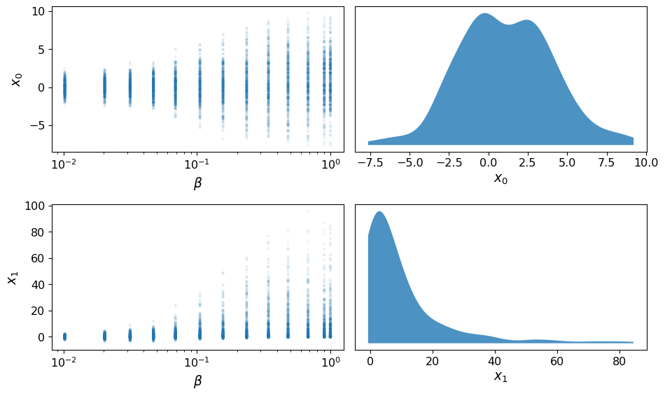
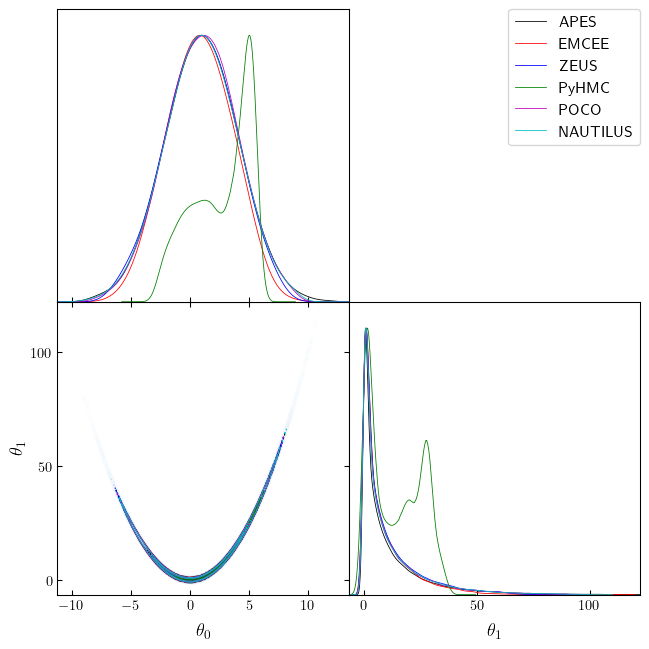
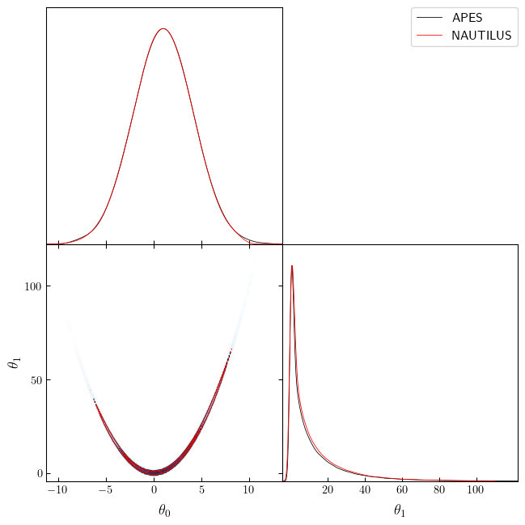

# Samplers comparison

## License

rosenbrock_simple

Sun Apr 02 21:13:00 2023  
Copyright 2023  
Sandro Dias Pinto Vitenti <vitenti@uel.br> \_\_\_ rosenbrock_simple  
Copyright (C) 2023 Sandro Dias Pinto Vitenti <vitenti@uel.br>

numcosmo is free software: you can redistribute it and/or modify it
under the terms of the GNU General Public License as published by the
Free Software Foundation, either version 3 of the License, or (at your
option) any later version.

numcosmo is distributed in the hope that it will be useful, but WITHOUT
ANY WARRANTY; without even the implied warranty of MERCHANTABILITY or
FITNESS FOR A PARTICULAR PURPOSE. See the GNU General Public License for
more details.

You should have received a copy of the GNU General Public License along
with this program. If not, see <http://www.gnu.org/licenses/>.

``` python
import sys

from numcosmo_py import Ncm

import matplotlib.pyplot as plt
import numpy as np
import getdist
import getdist.plots

from numcosmo_py.sampling.apes import APES
from numcosmo_py.sampling.catalog import Catalog
from numcosmo_py.plotting.tools import set_rc_params_article

import emcee
import zeus
from pyhmc import hmc
import pocomc
import nautilus
```

## Initialize NumCosmo and sampling parameters

In this notebook, we will compare the performance of four different
samplers: APES, Emcee, Zeus and PyHMC. To start, we will use the new
Python interface for NumCosmo.

Next, we will define the sampling configuration. Our goal is to generate
a total of 600,000 points across all three samplers, with each sampler
using 300 walkers except for PyHMC that generates a single chain. This
translates to 2000 steps on each sampler to reach our desired sample
size. By comparing the performance of these three samplers using the
NumCosmo Python interface, we can evaluate their respective capabilities
and identify any advantages or limitations for our specific problem.

``` python
Ncm.cfg_init()
Ncm.cfg_set_log_handler(lambda msg: sys.stdout.write(msg) and sys.stdout.flush())

ssize = 3000000
nwalkers = 300
burin_steps = 1200
verbose = False
```

## Probability definition

In the cell below, we will define the unnormalized Rosenbrock
distribution, which is known to be a difficult distribution to sample
from. The Rosenbrock distribution is often used as a benchmark for
testing the performance of sampling algorithms. By using this
challenging distribution, we can better understand how well the samplers
perform under difficult sampling conditions.

We will generate a single initial sample point with random normal
realizations having a mean of zero and a standard deviation of one. This
initial point will be used as the starting point for each of the
samplers, ensuring that they all start at the same point.

It’s worth noting that this initial sample point is very different from
a sample from an actual Rosenbrock distribution. However, this is
intentional, as we want to see how each sampler performs under
challenging conditions.

``` python
def log_prob(x, ivar):
    return -0.5 * (100.0 * (x[1] - x[0] * x[0]) ** 2 + (1.0 - x[0]) ** 2) * 1.0e-1


def log_prob_grad(x, ivar):
    logp = -0.5 * (100.0 * (x[1] - x[0] * x[0]) ** 2 + (1.0 - x[0]) ** 2) * 1.0e-1
    grad = [
        -0.5
        * (100.0 * 2.0 * (x[1] - x[0] * x[0]) * (-2.0 * x[0]) - 2.0 * (1.0 - x[0]))
        * 1.0e-1,
        -0.5 * (100.0 * 2.0 * (x[1] - x[0] * x[0])) * 1.0e-1,
    ]
    return logp, np.array(grad)


ndim, nwalkers = 2, nwalkers
p0 = np.random.randn(nwalkers, ndim)
```

## Running NumComo’s APES

In the cell below, we will run NumCosmo’s APES algorithm using the
configuration defined above.

``` python
sampler_apes = APES(
    nwalkers=nwalkers, ndim=ndim, model=None, log_prob=log_prob, args=()
)
sampler_apes.run_mcmc(p0, ssize // nwalkers)
mcat_apes = sampler_apes.get_catalog()
mcat_apes.trim(burin_steps)
```

## Running Emcee

In the cell below, we will run the Emcee algorithm with the same initial
point `p0` generated previously. We will generate a chain of samples
using Emcee and store the resulting chain in a `Catalog` object. This
will allow us to apply the same tests to all algorithms and compare
their performance on an even footing.

``` python
sampler_emcee = emcee.EnsembleSampler(nwalkers, ndim, log_prob, args=[0])
state_emcee = sampler_emcee.run_mcmc(p0, ssize // nwalkers)
chain_emcee = sampler_emcee.get_chain(flat=True)
log_prob_emcee = sampler_emcee.get_log_prob(flat=True)
mcat_emcee = Catalog(ndim=ndim, nwalkers=nwalkers, run_type="EMCEE")
mcat_emcee.add_points_m2lnp(chain_emcee, -2.0 * log_prob_emcee)
mcat_emcee.trim(burin_steps)
```

## Running Zeus

In the cell below, we will run the Zeus algorithm with the same initial
point `p0` generated previously. We will generate a chain of samples
using Zeus and store the resulting chain in a `Catalog` object. One
difference from Emcee is that Zeus output chains are not interweaved, so
we need to inform the `Catalog` object of this fact to ensure that
autocorrelation estimates are correct.

``` python
sampler_zeus = zeus.EnsembleSampler(nwalkers, ndim, log_prob, args=[0], verbose=verbose)
sampler_zeus.run_mcmc(p0, ssize // nwalkers, progress=False)
chain_zeus = sampler_zeus.get_chain(flat=True)
log_prob_zeus = sampler_zeus.get_log_prob(flat=True)
mcat_zeus = Catalog(ndim=ndim, nwalkers=nwalkers, run_type="ZEUS")
mcat_zeus.add_points_m2lnp(chain_zeus, -2.0 * log_prob_zeus, interweaved=False)
mcat_zeus.trim(burin_steps)
```

## Running pyhmc: Hamiltonian Monte Carlo

In the cell below, we will run the pyhmc algorithm with the same initial
point `p0` generated previously, however since pyhmc is not an ensemble
sampler we use only the first point. We will generate a chain of samples
using pyhmc and store the resulting chain in a `Catalog` object.
Moreover, here we need to remove a longer burn-in period of 1000
samples, since pyhmc is not an ensemble sampler.

``` python
chain_pyhmc, log_prob_pyhmc = hmc(
    log_prob_grad,
    x0=np.array(p0[0]),
    args=(np.array([0]),),
    n_samples=ssize,
    return_logp=True,
)
mcat_pyhmc = Catalog(ndim=ndim, nwalkers=1, run_type="PyHMC")
mcat_pyhmc.add_points_m2lnp(chain_pyhmc, -2.0 * log_prob_pyhmc)
mcat_pyhmc.trim(ssize // 2)
```

## Running PocoMC

In the cell below, we will run the pocomc algorithm with the same
initial point `p0` generated previously. We will generate a chain of
samples using PocoMC and store the resulting chain in a `Catalog`
object.

``` python
def log_prior(x):
    if np.any((x < -100.0) | (x > 100.0)):  # If any dimension is out of bounds, the log prior is -infinity
        return -np.inf 
    else:
        return 0.0

sampler = pocomc.Sampler(
    nwalkers,
    ndim,
    lambda x: log_prob(x,()),
    log_prior,
    vectorize_likelihood=True,
    bounds=(-100.0, 100.0)
)
sampler.run(p0)

results = sampler.results
```

    Iter: 0it [00:00, ?it/s]Iter: 0it [00:00, ?it/s, beta=0, calls=300, ESS=0.95, logZ=0, accept=0.234, N=0, scale=1]Iter: 1it [00:00, 1617.55it/s, beta=0.0103, calls=300, ESS=0.951, logZ=0, accept=0.234, N=0, scale=1]Iter: 1it [00:00, 964.21it/s, beta=0.0103, calls=300, ESS=0.951, logZ=-.144, accept=0.234, N=0, scale=1]Iter: 1it [00:00, 118.84it/s, beta=0.0103, calls=600, ESS=0.951, logZ=-.144, accept=0.63, N=1, scale=1.12, corr=0.569]Iter: 2it [00:01,  1.94it/s, beta=0.0103, calls=600, ESS=0.951, logZ=-.144, accept=0.63, N=1, scale=1.12, corr=0.569] Iter: 2it [00:01,  1.94it/s, beta=0.0204, calls=600, ESS=0.95, logZ=-.144, accept=0.63, N=1, scale=1.12, corr=0.569] Iter: 2it [00:01,  1.94it/s, beta=0.0204, calls=600, ESS=0.95, logZ=-.31, accept=0.63, N=1, scale=1.12, corr=0.569] Iter: 2it [00:01,  1.94it/s, beta=0.0204, calls=900, ESS=0.95, logZ=-.31, accept=0.432, N=1, scale=1.18, corr=0.665]Iter: 3it [00:02,  1.25it/s, beta=0.0204, calls=900, ESS=0.95, logZ=-.31, accept=0.432, N=1, scale=1.18, corr=0.665]Iter: 3it [00:02,  1.25it/s, beta=0.0316, calls=900, ESS=0.95, logZ=-.31, accept=0.432, N=1, scale=1.18, corr=0.665]Iter: 3it [00:02,  1.25it/s, beta=0.0316, calls=900, ESS=0.95, logZ=-.486, accept=0.432, N=1, scale=1.18, corr=0.665]Iter: 3it [00:02,  1.25it/s, beta=0.0316, calls=1200, ESS=0.95, logZ=-.486, accept=0.292, N=1, scale=1.19, corr=0.756]Iter: 3it [00:02,  1.25it/s, beta=0.0316, calls=1500, ESS=0.95, logZ=-.486, accept=0.263, N=2, scale=1.2, corr=0.633] Iter: 4it [00:05,  1.56s/it, beta=0.0316, calls=1500, ESS=0.95, logZ=-.486, accept=0.263, N=2, scale=1.2, corr=0.633]Iter: 4it [00:05,  1.56s/it, beta=0.0472, calls=1500, ESS=0.95, logZ=-.486, accept=0.263, N=2, scale=1.2, corr=0.633]Iter: 4it [00:05,  1.56s/it, beta=0.0472, calls=1500, ESS=0.95, logZ=-.665, accept=0.263, N=2, scale=1.2, corr=0.633]Iter: 4it [00:05,  1.56s/it, beta=0.0472, calls=1800, ESS=0.95, logZ=-.665, accept=0.322, N=1, scale=1.23, corr=0.651]Iter: 5it [00:05,  1.30s/it, beta=0.0472, calls=1800, ESS=0.95, logZ=-.665, accept=0.322, N=1, scale=1.23, corr=0.651]Iter: 5it [00:05,  1.30s/it, beta=0.0691, calls=1800, ESS=0.95, logZ=-.665, accept=0.322, N=1, scale=1.23, corr=0.651]Iter: 5it [00:05,  1.30s/it, beta=0.0691, calls=1800, ESS=0.95, logZ=-.844, accept=0.322, N=1, scale=1.23, corr=0.651]Iter: 5it [00:05,  1.30s/it, beta=0.0691, calls=2100, ESS=0.95, logZ=-.844, accept=0.385, N=1, scale=1.27, corr=0.668]Iter: 6it [00:06,  1.08s/it, beta=0.0691, calls=2100, ESS=0.95, logZ=-.844, accept=0.385, N=1, scale=1.27, corr=0.668]Iter: 6it [00:06,  1.08s/it, beta=0.105, calls=2100, ESS=0.951, logZ=-.844, accept=0.385, N=1, scale=1.27, corr=0.668]Iter: 6it [00:06,  1.08s/it, beta=0.105, calls=2100, ESS=0.951, logZ=-1.05, accept=0.385, N=1, scale=1.27, corr=0.668]Iter: 6it [00:06,  1.08s/it, beta=0.105, calls=2400, ESS=0.951, logZ=-1.05, accept=0.299, N=1, scale=1.29, corr=0.704]Iter: 7it [00:09,  1.70s/it, beta=0.105, calls=2400, ESS=0.951, logZ=-1.05, accept=0.299, N=1, scale=1.29, corr=0.704]Iter: 7it [00:09,  1.70s/it, beta=0.157, calls=2400, ESS=0.95, logZ=-1.05, accept=0.299, N=1, scale=1.29, corr=0.704] Iter: 7it [00:09,  1.70s/it, beta=0.157, calls=2400, ESS=0.95, logZ=-1.25, accept=0.299, N=1, scale=1.29, corr=0.704]Iter: 7it [00:09,  1.70s/it, beta=0.157, calls=2700, ESS=0.95, logZ=-1.25, accept=0.33, N=1, scale=1.32, corr=0.657] Iter: 8it [00:10,  1.51s/it, beta=0.157, calls=2700, ESS=0.95, logZ=-1.25, accept=0.33, N=1, scale=1.32, corr=0.657]Iter: 8it [00:10,  1.51s/it, beta=0.236, calls=2700, ESS=0.951, logZ=-1.25, accept=0.33, N=1, scale=1.32, corr=0.657]Iter: 8it [00:10,  1.51s/it, beta=0.236, calls=2700, ESS=0.951, logZ=-1.47, accept=0.33, N=1, scale=1.32, corr=0.657]Iter: 8it [00:10,  1.51s/it, beta=0.236, calls=3000, ESS=0.951, logZ=-1.47, accept=0.26, N=1, scale=1.33, corr=0.776]Iter: 8it [00:10,  1.51s/it, beta=0.236, calls=3300, ESS=0.951, logZ=-1.47, accept=0.269, N=2, scale=1.33, corr=0.603]Iter: 9it [00:11,  1.34s/it, beta=0.236, calls=3300, ESS=0.951, logZ=-1.47, accept=0.269, N=2, scale=1.33, corr=0.603]Iter: 9it [00:11,  1.34s/it, beta=0.343, calls=3300, ESS=0.949, logZ=-1.47, accept=0.269, N=2, scale=1.33, corr=0.603]Iter: 9it [00:11,  1.34s/it, beta=0.343, calls=3300, ESS=0.949, logZ=-1.7, accept=0.269, N=2, scale=1.33, corr=0.603] Iter: 9it [00:11,  1.34s/it, beta=0.343, calls=3600, ESS=0.949, logZ=-1.7, accept=0.226, N=1, scale=1.33, corr=0.811]Iter: 9it [00:11,  1.34s/it, beta=0.343, calls=3900, ESS=0.949, logZ=-1.7, accept=0.262, N=2, scale=1.34, corr=0.61] Iter: 10it [00:12,  1.34s/it, beta=0.343, calls=3900, ESS=0.949, logZ=-1.7, accept=0.262, N=2, scale=1.34, corr=0.61]Iter: 10it [00:12,  1.34s/it, beta=0.482, calls=3900, ESS=0.95, logZ=-1.7, accept=0.262, N=2, scale=1.34, corr=0.61] Iter: 10it [00:12,  1.34s/it, beta=0.482, calls=3900, ESS=0.95, logZ=-1.93, accept=0.262, N=2, scale=1.34, corr=0.61]Iter: 10it [00:12,  1.34s/it, beta=0.482, calls=4200, ESS=0.95, logZ=-1.93, accept=0.204, N=1, scale=1.33, corr=0.776]Iter: 10it [00:12,  1.34s/it, beta=0.482, calls=4500, ESS=0.95, logZ=-1.93, accept=0.221, N=2, scale=1.32, corr=0.684]Iter: 11it [00:14,  1.37s/it, beta=0.482, calls=4500, ESS=0.95, logZ=-1.93, accept=0.221, N=2, scale=1.32, corr=0.684]Iter: 11it [00:14,  1.37s/it, beta=0.68, calls=4500, ESS=0.95, logZ=-1.93, accept=0.221, N=2, scale=1.32, corr=0.684] Iter: 11it [00:14,  1.37s/it, beta=0.68, calls=4500, ESS=0.95, logZ=-2.18, accept=0.221, N=2, scale=1.32, corr=0.684]Iter: 11it [00:14,  1.37s/it, beta=0.68, calls=4800, ESS=0.95, logZ=-2.18, accept=0.245, N=1, scale=1.33, corr=0.771]Iter: 11it [00:14,  1.37s/it, beta=0.68, calls=5100, ESS=0.95, logZ=-2.18, accept=0.221, N=2, scale=1.33, corr=0.64] Iter: 12it [00:15,  1.26s/it, beta=0.68, calls=5100, ESS=0.95, logZ=-2.18, accept=0.221, N=2, scale=1.33, corr=0.64]Iter: 12it [00:15,  1.26s/it, beta=0.9, calls=5100, ESS=0.95, logZ=-2.18, accept=0.221, N=2, scale=1.33, corr=0.64] Iter: 12it [00:15,  1.26s/it, beta=0.9, calls=5100, ESS=0.95, logZ=-2.42, accept=0.221, N=2, scale=1.33, corr=0.64]Iter: 12it [00:15,  1.26s/it, beta=0.9, calls=5400, ESS=0.95, logZ=-2.42, accept=0.163, N=1, scale=1.3, corr=0.835]Iter: 12it [00:15,  1.26s/it, beta=0.9, calls=5700, ESS=0.95, logZ=-2.42, accept=0.224, N=2, scale=1.3, corr=0.658]Iter: 13it [00:16,  1.14s/it, beta=0.9, calls=5700, ESS=0.95, logZ=-2.42, accept=0.224, N=2, scale=1.3, corr=0.658]Iter: 13it [00:16,  1.14s/it, beta=1, calls=5700, ESS=0.994, logZ=-2.42, accept=0.224, N=2, scale=1.3, corr=0.658] Iter: 13it [00:16,  1.14s/it, beta=1, calls=5700, ESS=0.994, logZ=-2.5, accept=0.224, N=2, scale=1.3, corr=0.658] Iter: 13it [00:16,  1.14s/it, beta=1, calls=6000, ESS=0.994, logZ=-2.5, accept=0.216, N=1, scale=1.3, corr=0.82] Iter: 13it [00:16,  1.14s/it, beta=1, calls=6300, ESS=0.994, logZ=-2.5, accept=0.239, N=2, scale=1.3, corr=0.629]Iter: 13it [00:17,  1.31s/it, beta=1, calls=6300, ESS=0.994, logZ=-2.5, accept=0.239, N=2, scale=1.3, corr=0.629]

``` python
print(f"NCalls total {np.sum(results['ncall'])}")
print(f"Samples shape {results['samples'].shape}")
```

    NCalls total 41100
    Samples shape (300, 2)

``` python
_, max_ess = mcat_apes._catalog.calc_max_ess_time(100, 0)
iid_in_apes = int(max_ess * nwalkers)

sampler.add_samples(n=iid_in_apes)
results = sampler.results
```

    Iter: 0it [00:00, ?it/s]Iter: 0it [00:00, ?it/s, beta=1, calls=6300, ESS=0.95, logZ=-2.5, accept=0, N=0, scale=0]Iter: 0it [00:00, ?it/s, beta=1, calls=6600, ESS=0.95, logZ=-2.5, accept=0.249, N=1, scale=1.3, corr=0.778]Iter: 0it [00:00, ?it/s, beta=1, calls=6900, ESS=0.95, logZ=-2.5, accept=0.211, N=2, scale=1.3, corr=0.673]Iter: 1it [00:00, 52.62it/s, beta=1, calls=7200, ESS=0.95, logZ=-2.5, accept=0.226, N=1, scale=1.3, corr=0.837]Iter: 1it [00:00, 40.47it/s, beta=1, calls=7500, ESS=0.95, logZ=-2.5, accept=0.21, N=2, scale=1.29, corr=0.734]Iter: 2it [00:00, 46.26it/s, beta=1, calls=7800, ESS=0.95, logZ=-2.5, accept=0.29, N=1, scale=1.31, corr=0.823]Iter: 2it [00:00, 39.92it/s, beta=1, calls=8100, ESS=0.95, logZ=-2.5, accept=0.238, N=2, scale=1.31, corr=0.661]Iter: 3it [00:00, 53.44it/s, beta=1, calls=8400, ESS=0.95, logZ=-2.5, accept=0.17, N=1, scale=1.29, corr=0.882] Iter: 3it [00:00, 48.61it/s, beta=1, calls=8700, ESS=0.95, logZ=-2.5, accept=0.211, N=2, scale=1.28, corr=0.751]Iter: 3it [00:00, 44.39it/s, beta=1, calls=9000, ESS=0.95, logZ=-2.5, accept=0.252, N=3, scale=1.29, corr=0.575]Iter: 4it [00:00, 54.33it/s, beta=1, calls=9300, ESS=0.95, logZ=-2.5, accept=0.227, N=1, scale=1.29, corr=0.856]Iter: 4it [00:00, 50.52it/s, beta=1, calls=9600, ESS=0.95, logZ=-2.5, accept=0.203, N=2, scale=1.28, corr=0.719]Iter: 5it [00:00, 58.69it/s, beta=1, calls=9900, ESS=0.95, logZ=-2.5, accept=0.2, N=1, scale=1.27, corr=0.854]  Iter: 5it [00:00, 55.11it/s, beta=1, calls=10200, ESS=0.95, logZ=-2.5, accept=0.232, N=2, scale=1.27, corr=0.742]Iter: 6it [00:00, 62.01it/s, beta=1, calls=10500, ESS=0.95, logZ=-2.5, accept=0.23, N=1, scale=1.27, corr=0.805] Iter: 6it [00:00, 58.63it/s, beta=1, calls=10800, ESS=0.95, logZ=-2.5, accept=0.238, N=2, scale=1.27, corr=0.637]Iter: 7it [00:00, 68.16it/s, beta=1, calls=10800, ESS=0.95, logZ=-2.5, accept=0.238, N=2, scale=1.27, corr=0.637]Iter: 7it [00:00, 68.16it/s, beta=1, calls=11100, ESS=0.95, logZ=-2.5, accept=0.268, N=1, scale=1.28, corr=0.783]Iter: 7it [00:00, 68.16it/s, beta=1, calls=11400, ESS=0.95, logZ=-2.5, accept=0.221, N=2, scale=1.28, corr=0.627]Iter: 8it [00:00, 68.16it/s, beta=1, calls=11700, ESS=0.95, logZ=-2.5, accept=0.205, N=1, scale=1.27, corr=0.892]Iter: 8it [00:00, 68.16it/s, beta=1, calls=12000, ESS=0.95, logZ=-2.5, accept=0.227, N=2, scale=1.27, corr=0.752]Iter: 8it [00:00, 68.16it/s, beta=1, calls=12300, ESS=0.95, logZ=-2.5, accept=0.232, N=3, scale=1.27, corr=0.616]Iter: 9it [00:00, 68.16it/s, beta=1, calls=12600, ESS=0.95, logZ=-2.5, accept=0.229, N=1, scale=1.26, corr=0.87] Iter: 9it [00:00, 68.16it/s, beta=1, calls=12900, ESS=0.95, logZ=-2.5, accept=0.231, N=2, scale=1.26, corr=0.733]Iter: 10it [00:00, 68.16it/s, beta=1, calls=13200, ESS=0.95, logZ=-2.5, accept=0.228, N=1, scale=1.26, corr=0.786]Iter: 10it [00:00, 68.16it/s, beta=1, calls=13500, ESS=0.95, logZ=-2.5, accept=0.246, N=2, scale=1.26, corr=0.617]Iter: 11it [00:00, 68.16it/s, beta=1, calls=13800, ESS=0.95, logZ=-2.5, accept=0.285, N=1, scale=1.28, corr=0.785]Iter: 11it [00:00, 68.16it/s, beta=1, calls=14100, ESS=0.95, logZ=-2.5, accept=0.201, N=2, scale=1.27, corr=0.633]Iter: 12it [00:00, 68.16it/s, beta=1, calls=14400, ESS=0.95, logZ=-2.5, accept=0.277, N=1, scale=1.29, corr=0.778]Iter: 12it [00:00, 68.16it/s, beta=1, calls=14700, ESS=0.95, logZ=-2.5, accept=0.21, N=2, scale=1.28, corr=0.645] Iter: 13it [00:00, 68.16it/s, beta=1, calls=15000, ESS=0.95, logZ=-2.5, accept=0.216, N=1, scale=1.28, corr=0.816]Iter: 13it [00:00, 68.16it/s, beta=1, calls=15300, ESS=0.95, logZ=-2.5, accept=0.237, N=2, scale=1.28, corr=0.679]Iter: 14it [00:00, 68.16it/s, beta=1, calls=15600, ESS=0.95, logZ=-2.5, accept=0.223, N=1, scale=1.27, corr=0.825]Iter: 14it [00:00, 68.16it/s, beta=1, calls=15900, ESS=0.95, logZ=-2.5, accept=0.234, N=2, scale=1.27, corr=0.721]Iter: 15it [00:00, 74.31it/s, beta=1, calls=15900, ESS=0.95, logZ=-2.5, accept=0.234, N=2, scale=1.27, corr=0.721]Iter: 15it [00:00, 74.31it/s, beta=1, calls=16200, ESS=0.95, logZ=-2.5, accept=0.199, N=1, scale=1.26, corr=0.792]Iter: 15it [00:00, 74.31it/s, beta=1, calls=16500, ESS=0.95, logZ=-2.5, accept=0.241, N=2, scale=1.26, corr=0.577]Iter: 16it [00:00, 74.31it/s, beta=1, calls=16800, ESS=0.95, logZ=-2.5, accept=0.228, N=1, scale=1.26, corr=0.827]Iter: 16it [00:00, 74.31it/s, beta=1, calls=17100, ESS=0.95, logZ=-2.5, accept=0.248, N=2, scale=1.26, corr=0.665]Iter: 17it [00:00, 74.31it/s, beta=1, calls=17400, ESS=0.95, logZ=-2.5, accept=0.22, N=1, scale=1.26, corr=0.777] Iter: 17it [00:00, 74.31it/s, beta=1, calls=17700, ESS=0.95, logZ=-2.5, accept=0.238, N=2, scale=1.26, corr=0.654]Iter: 18it [00:00, 74.31it/s, beta=1, calls=18000, ESS=0.95, logZ=-2.5, accept=0.239, N=1, scale=1.26, corr=0.806]Iter: 18it [00:00, 74.31it/s, beta=1, calls=18300, ESS=0.95, logZ=-2.5, accept=0.235, N=2, scale=1.26, corr=0.694]Iter: 19it [00:00, 74.31it/s, beta=1, calls=18600, ESS=0.95, logZ=-2.5, accept=0.24, N=1, scale=1.26, corr=0.85]  Iter: 19it [00:00, 74.31it/s, beta=1, calls=18900, ESS=0.95, logZ=-2.5, accept=0.245, N=2, scale=1.27, corr=0.678]Iter: 20it [00:00, 74.31it/s, beta=1, calls=19200, ESS=0.95, logZ=-2.5, accept=0.242, N=1, scale=1.27, corr=0.787]Iter: 20it [00:00, 74.31it/s, beta=1, calls=19500, ESS=0.95, logZ=-2.5, accept=0.222, N=2, scale=1.27, corr=0.681]Iter: 21it [00:00, 74.31it/s, beta=1, calls=19800, ESS=0.95, logZ=-2.5, accept=0.246, N=1, scale=1.27, corr=0.802]Iter: 21it [00:00, 74.31it/s, beta=1, calls=20100, ESS=0.95, logZ=-2.5, accept=0.24, N=2, scale=1.27, corr=0.67]  Iter: 22it [00:00, 74.31it/s, beta=1, calls=20400, ESS=0.95, logZ=-2.5, accept=0.217, N=1, scale=1.27, corr=0.807]Iter: 22it [00:00, 74.31it/s, beta=1, calls=20700, ESS=0.95, logZ=-2.5, accept=0.238, N=2, scale=1.27, corr=0.637]Iter: 23it [00:00, 76.68it/s, beta=1, calls=20700, ESS=0.95, logZ=-2.5, accept=0.238, N=2, scale=1.27, corr=0.637]Iter: 23it [00:00, 76.68it/s, beta=1, calls=21000, ESS=0.95, logZ=-2.5, accept=0.243, N=1, scale=1.27, corr=0.764]Iter: 23it [00:00, 76.68it/s, beta=1, calls=21300, ESS=0.95, logZ=-2.5, accept=0.24, N=2, scale=1.27, corr=0.587] Iter: 24it [00:00, 76.68it/s, beta=1, calls=21600, ESS=0.95, logZ=-2.5, accept=0.202, N=1, scale=1.26, corr=0.851]Iter: 24it [00:00, 76.68it/s, beta=1, calls=21900, ESS=0.95, logZ=-2.5, accept=0.251, N=2, scale=1.27, corr=0.692]Iter: 25it [00:00, 76.68it/s, beta=1, calls=22200, ESS=0.95, logZ=-2.5, accept=0.242, N=1, scale=1.27, corr=0.847]Iter: 25it [00:00, 76.68it/s, beta=1, calls=22500, ESS=0.95, logZ=-2.5, accept=0.269, N=2, scale=1.27, corr=0.654]Iter: 26it [00:00, 76.68it/s, beta=1, calls=22800, ESS=0.95, logZ=-2.5, accept=0.234, N=1, scale=1.27, corr=0.731]Iter: 27it [00:00, 76.68it/s, beta=1, calls=23100, ESS=0.95, logZ=-2.5, accept=0.245, N=1, scale=1.28, corr=0.783]Iter: 27it [00:00, 76.68it/s, beta=1, calls=23400, ESS=0.95, logZ=-2.5, accept=0.235, N=2, scale=1.28, corr=0.625]Iter: 28it [00:00, 76.68it/s, beta=1, calls=23700, ESS=0.95, logZ=-2.5, accept=0.264, N=1, scale=1.29, corr=0.79] Iter: 28it [00:00, 76.68it/s, beta=1, calls=24000, ESS=0.95, logZ=-2.5, accept=0.247, N=2, scale=1.29, corr=0.642]Iter: 29it [00:00, 76.68it/s, beta=1, calls=24300, ESS=0.95, logZ=-2.5, accept=0.236, N=1, scale=1.29, corr=0.777]Iter: 29it [00:00, 76.68it/s, beta=1, calls=24600, ESS=0.95, logZ=-2.5, accept=0.188, N=2, scale=1.28, corr=0.702]Iter: 30it [00:00, 76.68it/s, beta=1, calls=24900, ESS=0.95, logZ=-2.5, accept=0.199, N=1, scale=1.27, corr=0.803]Iter: 30it [00:00, 76.68it/s, beta=1, calls=25200, ESS=0.95, logZ=-2.5, accept=0.247, N=2, scale=1.27, corr=0.648]Iter: 31it [00:00, 76.68it/s, beta=1, calls=25500, ESS=0.95, logZ=-2.5, accept=0.217, N=1, scale=1.27, corr=0.763]Iter: 31it [00:00, 76.68it/s, beta=1, calls=25800, ESS=0.95, logZ=-2.5, accept=0.23, N=2, scale=1.27, corr=0.6]   Iter: 32it [00:00, 78.54it/s, beta=1, calls=25800, ESS=0.95, logZ=-2.5, accept=0.23, N=2, scale=1.27, corr=0.6]Iter: 32it [00:00, 78.54it/s, beta=1, calls=26100, ESS=0.95, logZ=-2.5, accept=0.248, N=1, scale=1.27, corr=0.765]Iter: 32it [00:00, 78.54it/s, beta=1, calls=26400, ESS=0.95, logZ=-2.5, accept=0.253, N=2, scale=1.28, corr=0.612]Iter: 33it [00:00, 78.54it/s, beta=1, calls=26700, ESS=0.95, logZ=-2.5, accept=0.213, N=1, scale=1.27, corr=0.84] Iter: 33it [00:00, 78.54it/s, beta=1, calls=27000, ESS=0.95, logZ=-2.5, accept=0.253, N=2, scale=1.27, corr=0.638]Iter: 34it [00:00, 78.54it/s, beta=1, calls=27300, ESS=0.95, logZ=-2.5, accept=0.216, N=1, scale=1.27, corr=0.769]Iter: 34it [00:00, 78.54it/s, beta=1, calls=27600, ESS=0.95, logZ=-2.5, accept=0.195, N=2, scale=1.26, corr=0.671]Iter: 35it [00:00, 78.54it/s, beta=1, calls=27900, ESS=0.95, logZ=-2.5, accept=0.235, N=1, scale=1.26, corr=0.833]Iter: 35it [00:00, 78.54it/s, beta=1, calls=28200, ESS=0.95, logZ=-2.5, accept=0.225, N=2, scale=1.26, corr=0.714]Iter: 36it [00:00, 78.54it/s, beta=1, calls=28500, ESS=0.95, logZ=-2.5, accept=0.27, N=1, scale=1.27, corr=0.732] Iter: 37it [00:00, 78.54it/s, beta=1, calls=28800, ESS=0.95, logZ=-2.5, accept=0.24, N=1, scale=1.27, corr=0.775]Iter: 37it [00:00, 78.54it/s, beta=1, calls=29100, ESS=0.95, logZ=-2.5, accept=0.236, N=2, scale=1.27, corr=0.643]Iter: 38it [00:00, 78.54it/s, beta=1, calls=29400, ESS=0.95, logZ=-2.5, accept=0.239, N=1, scale=1.27, corr=0.843]Iter: 38it [00:00, 78.54it/s, beta=1, calls=29700, ESS=0.95, logZ=-2.5, accept=0.225, N=2, scale=1.27, corr=0.712]Iter: 39it [00:00, 78.54it/s, beta=1, calls=3e+4, ESS=0.95, logZ=-2.5, accept=0.23, N=1, scale=1.27, corr=0.824]  Iter: 39it [00:00, 78.54it/s, beta=1, calls=30300, ESS=0.95, logZ=-2.5, accept=0.241, N=2, scale=1.27, corr=0.656]Iter: 40it [00:00, 78.63it/s, beta=1, calls=30300, ESS=0.95, logZ=-2.5, accept=0.241, N=2, scale=1.27, corr=0.656]Iter: 40it [00:00, 78.63it/s, beta=1, calls=30600, ESS=0.95, logZ=-2.5, accept=0.219, N=1, scale=1.27, corr=0.859]Iter: 40it [00:00, 78.63it/s, beta=1, calls=30900, ESS=0.95, logZ=-2.5, accept=0.265, N=2, scale=1.27, corr=0.678]Iter: 41it [00:00, 78.63it/s, beta=1, calls=31200, ESS=0.95, logZ=-2.5, accept=0.223, N=1, scale=1.27, corr=0.849]Iter: 41it [00:00, 78.63it/s, beta=1, calls=31500, ESS=0.95, logZ=-2.5, accept=0.251, N=2, scale=1.27, corr=0.673]Iter: 42it [00:00, 78.63it/s, beta=1, calls=31800, ESS=0.95, logZ=-2.5, accept=0.25, N=1, scale=1.28, corr=0.766] Iter: 42it [00:00, 78.63it/s, beta=1, calls=32100, ESS=0.95, logZ=-2.5, accept=0.295, N=2, scale=1.29, corr=0.622]Iter: 43it [00:00, 78.63it/s, beta=1, calls=32400, ESS=0.95, logZ=-2.5, accept=0.191, N=1, scale=1.28, corr=0.822]Iter: 43it [00:00, 78.63it/s, beta=1, calls=32700, ESS=0.95, logZ=-2.5, accept=0.226, N=2, scale=1.28, corr=0.705]Iter: 44it [00:00, 78.63it/s, beta=1, calls=33000, ESS=0.95, logZ=-2.5, accept=0.203, N=1, scale=1.27, corr=0.843]Iter: 44it [00:00, 78.63it/s, beta=1, calls=33300, ESS=0.95, logZ=-2.5, accept=0.224, N=2, scale=1.26, corr=0.661]Iter: 45it [00:00, 78.63it/s, beta=1, calls=33600, ESS=0.95, logZ=-2.5, accept=0.225, N=1, scale=1.26, corr=0.815]Iter: 45it [00:00, 78.63it/s, beta=1, calls=33900, ESS=0.95, logZ=-2.5, accept=0.265, N=2, scale=1.27, corr=0.634]Iter: 46it [00:00, 78.63it/s, beta=1, calls=34200, ESS=0.95, logZ=-2.5, accept=0.246, N=1, scale=1.27, corr=0.802]Iter: 46it [00:00, 78.63it/s, beta=1, calls=34500, ESS=0.95, logZ=-2.5, accept=0.224, N=2, scale=1.27, corr=0.703]Iter: 47it [00:00, 78.63it/s, beta=1, calls=34800, ESS=0.95, logZ=-2.5, accept=0.236, N=1, scale=1.27, corr=0.841]Iter: 47it [00:00, 78.63it/s, beta=1, calls=35100, ESS=0.95, logZ=-2.5, accept=0.215, N=2, scale=1.27, corr=0.743]Iter: 48it [00:00, 78.30it/s, beta=1, calls=35100, ESS=0.95, logZ=-2.5, accept=0.215, N=2, scale=1.27, corr=0.743]Iter: 48it [00:00, 78.30it/s, beta=1, calls=35400, ESS=0.95, logZ=-2.5, accept=0.22, N=1, scale=1.26, corr=0.81]  Iter: 48it [00:00, 78.30it/s, beta=1, calls=35700, ESS=0.95, logZ=-2.5, accept=0.216, N=2, scale=1.26, corr=0.694]Iter: 49it [00:00, 78.30it/s, beta=1, calls=36000, ESS=0.95, logZ=-2.5, accept=0.19, N=1, scale=1.25, corr=0.839] Iter: 49it [00:00, 78.30it/s, beta=1, calls=36300, ESS=0.95, logZ=-2.5, accept=0.25, N=2, scale=1.25, corr=0.732]Iter: 50it [00:00, 78.30it/s, beta=1, calls=36600, ESS=0.95, logZ=-2.5, accept=0.281, N=1, scale=1.26, corr=0.828]Iter: 50it [00:00, 78.30it/s, beta=1, calls=36900, ESS=0.95, logZ=-2.5, accept=0.241, N=2, scale=1.26, corr=0.686]Iter: 51it [00:00, 78.30it/s, beta=1, calls=37200, ESS=0.95, logZ=-2.5, accept=0.266, N=1, scale=1.27, corr=0.803]Iter: 51it [00:00, 78.30it/s, beta=1, calls=37500, ESS=0.95, logZ=-2.5, accept=0.216, N=2, scale=1.27, corr=0.626]Iter: 52it [00:00, 78.30it/s, beta=1, calls=37800, ESS=0.95, logZ=-2.5, accept=0.247, N=1, scale=1.27, corr=0.833]Iter: 52it [00:00, 78.30it/s, beta=1, calls=38100, ESS=0.95, logZ=-2.5, accept=0.184, N=2, scale=1.26, corr=0.747]Iter: 53it [00:00, 78.30it/s, beta=1, calls=38400, ESS=0.95, logZ=-2.5, accept=0.224, N=1, scale=1.26, corr=0.874]Iter: 53it [00:00, 78.30it/s, beta=1, calls=38700, ESS=0.95, logZ=-2.5, accept=0.244, N=2, scale=1.26, corr=0.759]Iter: 53it [00:00, 78.30it/s, beta=1, calls=39000, ESS=0.95, logZ=-2.5, accept=0.234, N=3, scale=1.26, corr=0.619]Iter: 54it [00:00, 78.30it/s, beta=1, calls=39300, ESS=0.95, logZ=-2.5, accept=0.275, N=1, scale=1.27, corr=0.795]Iter: 54it [00:00, 78.30it/s, beta=1, calls=39600, ESS=0.95, logZ=-2.5, accept=0.242, N=2, scale=1.28, corr=0.639]Iter: 55it [00:00, 78.30it/s, beta=1, calls=39900, ESS=0.95, logZ=-2.5, accept=0.239, N=1, scale=1.28, corr=0.834]Iter: 55it [00:00, 78.30it/s, beta=1, calls=40200, ESS=0.95, logZ=-2.5, accept=0.23, N=2, scale=1.28, corr=0.692] Iter: 56it [00:00, 76.28it/s, beta=1, calls=40200, ESS=0.95, logZ=-2.5, accept=0.23, N=2, scale=1.28, corr=0.692]Iter: 56it [00:00, 76.28it/s, beta=1, calls=40500, ESS=0.95, logZ=-2.5, accept=0.207, N=1, scale=1.27, corr=0.858]Iter: 56it [00:00, 76.28it/s, beta=1, calls=40800, ESS=0.95, logZ=-2.5, accept=0.243, N=2, scale=1.27, corr=0.699]Iter: 57it [00:00, 76.28it/s, beta=1, calls=41100, ESS=0.95, logZ=-2.5, accept=0.209, N=1, scale=1.26, corr=0.813]Iter: 57it [00:00, 76.28it/s, beta=1, calls=41400, ESS=0.95, logZ=-2.5, accept=0.233, N=2, scale=1.26, corr=0.734]Iter: 58it [00:00, 76.28it/s, beta=1, calls=41700, ESS=0.95, logZ=-2.5, accept=0.239, N=1, scale=1.26, corr=0.841]Iter: 58it [00:00, 76.28it/s, beta=1, calls=42000, ESS=0.95, logZ=-2.5, accept=0.249, N=2, scale=1.27, corr=0.67] Iter: 59it [00:00, 76.28it/s, beta=1, calls=42300, ESS=0.95, logZ=-2.5, accept=0.276, N=1, scale=1.28, corr=0.822]Iter: 59it [00:00, 76.28it/s, beta=1, calls=42600, ESS=0.95, logZ=-2.5, accept=0.207, N=2, scale=1.27, corr=0.689]Iter: 60it [00:00, 76.28it/s, beta=1, calls=42900, ESS=0.95, logZ=-2.5, accept=0.231, N=1, scale=1.27, corr=0.861]Iter: 60it [00:00, 76.28it/s, beta=1, calls=43200, ESS=0.95, logZ=-2.5, accept=0.203, N=2, scale=1.27, corr=0.741]Iter: 61it [00:00, 76.28it/s, beta=1, calls=43500, ESS=0.95, logZ=-2.5, accept=0.26, N=1, scale=1.28, corr=0.812] Iter: 61it [00:00, 76.28it/s, beta=1, calls=43800, ESS=0.95, logZ=-2.5, accept=0.273, N=2, scale=1.28, corr=0.624]Iter: 62it [00:00, 76.28it/s, beta=1, calls=44100, ESS=0.95, logZ=-2.5, accept=0.255, N=1, scale=1.29, corr=0.829]Iter: 62it [00:00, 76.28it/s, beta=1, calls=44400, ESS=0.95, logZ=-2.5, accept=0.229, N=2, scale=1.29, corr=0.705]Iter: 63it [00:00, 76.28it/s, beta=1, calls=44700, ESS=0.95, logZ=-2.5, accept=0.211, N=1, scale=1.28, corr=0.841]Iter: 63it [00:00, 76.28it/s, beta=1, calls=45000, ESS=0.95, logZ=-2.5, accept=0.227, N=2, scale=1.28, corr=0.716]Iter: 64it [00:00, 76.64it/s, beta=1, calls=45000, ESS=0.95, logZ=-2.5, accept=0.227, N=2, scale=1.28, corr=0.716]Iter: 64it [00:00, 76.64it/s, beta=1, calls=45300, ESS=0.95, logZ=-2.5, accept=0.228, N=1, scale=1.28, corr=0.832]Iter: 64it [00:00, 76.64it/s, beta=1, calls=45600, ESS=0.95, logZ=-2.5, accept=0.258, N=2, scale=1.28, corr=0.687]Iter: 65it [00:00, 76.64it/s, beta=1, calls=45900, ESS=0.95, logZ=-2.5, accept=0.218, N=1, scale=1.28, corr=0.821]Iter: 65it [00:00, 76.64it/s, beta=1, calls=46200, ESS=0.95, logZ=-2.5, accept=0.222, N=2, scale=1.28, corr=0.708]Iter: 66it [00:00, 76.64it/s, beta=1, calls=46500, ESS=0.95, logZ=-2.5, accept=0.26, N=1, scale=1.28, corr=0.825] Iter: 66it [00:00, 76.64it/s, beta=1, calls=46800, ESS=0.95, logZ=-2.5, accept=0.211, N=2, scale=1.28, corr=0.691]Iter: 67it [00:00, 76.64it/s, beta=1, calls=47100, ESS=0.95, logZ=-2.5, accept=0.234, N=1, scale=1.28, corr=0.854]Iter: 67it [00:00, 76.64it/s, beta=1, calls=47400, ESS=0.95, logZ=-2.5, accept=0.213, N=2, scale=1.28, corr=0.734]Iter: 68it [00:00, 76.64it/s, beta=1, calls=47700, ESS=0.95, logZ=-2.5, accept=0.283, N=1, scale=1.29, corr=0.815]Iter: 68it [00:00, 76.64it/s, beta=1, calls=48000, ESS=0.95, logZ=-2.5, accept=0.257, N=2, scale=1.29, corr=0.656]Iter: 69it [00:00, 76.64it/s, beta=1, calls=48300, ESS=0.95, logZ=-2.5, accept=0.204, N=1, scale=1.29, corr=0.844]Iter: 69it [00:00, 76.64it/s, beta=1, calls=48600, ESS=0.95, logZ=-2.5, accept=0.222, N=2, scale=1.28, corr=0.704]Iter: 70it [00:00, 76.64it/s, beta=1, calls=48900, ESS=0.95, logZ=-2.5, accept=0.21, N=1, scale=1.28, corr=0.855] Iter: 70it [00:00, 76.64it/s, beta=1, calls=49200, ESS=0.95, logZ=-2.5, accept=0.249, N=2, scale=1.28, corr=0.684]Iter: 71it [00:00, 76.64it/s, beta=1, calls=49500, ESS=0.95, logZ=-2.5, accept=0.228, N=1, scale=1.28, corr=0.808]Iter: 71it [00:00, 76.64it/s, beta=1, calls=49800, ESS=0.95, logZ=-2.5, accept=0.212, N=2, scale=1.27, corr=0.646]Iter: 72it [00:00, 76.27it/s, beta=1, calls=49800, ESS=0.95, logZ=-2.5, accept=0.212, N=2, scale=1.27, corr=0.646]Iter: 72it [00:00, 76.27it/s, beta=1, calls=50100, ESS=0.95, logZ=-2.5, accept=0.223, N=1, scale=1.27, corr=0.843]Iter: 72it [00:00, 76.27it/s, beta=1, calls=50400, ESS=0.95, logZ=-2.5, accept=0.231, N=2, scale=1.27, corr=0.729]Iter: 73it [00:00, 76.27it/s, beta=1, calls=50700, ESS=0.95, logZ=-2.5, accept=0.204, N=1, scale=1.26, corr=0.868]Iter: 73it [00:00, 76.27it/s, beta=1, calls=51000, ESS=0.95, logZ=-2.5, accept=0.253, N=2, scale=1.26, corr=0.705]Iter: 74it [00:00, 76.27it/s, beta=1, calls=51300, ESS=0.95, logZ=-2.5, accept=0.21, N=1, scale=1.26, corr=0.843] Iter: 74it [00:00, 76.27it/s, beta=1, calls=51600, ESS=0.95, logZ=-2.5, accept=0.257, N=2, scale=1.26, corr=0.7] Iter: 75it [00:00, 76.27it/s, beta=1, calls=51900, ESS=0.95, logZ=-2.5, accept=0.229, N=1, scale=1.26, corr=0.849]Iter: 75it [00:00, 76.27it/s, beta=1, calls=52200, ESS=0.95, logZ=-2.5, accept=0.253, N=2, scale=1.26, corr=0.683]Iter: 76it [00:00, 76.27it/s, beta=1, calls=52500, ESS=0.95, logZ=-2.5, accept=0.243, N=1, scale=1.27, corr=0.78] Iter: 76it [00:01, 76.27it/s, beta=1, calls=52800, ESS=0.95, logZ=-2.5, accept=0.279, N=2, scale=1.27, corr=0.687]Iter: 77it [00:01, 76.27it/s, beta=1, calls=53100, ESS=0.95, logZ=-2.5, accept=0.242, N=1, scale=1.28, corr=0.845]Iter: 77it [00:01, 76.27it/s, beta=1, calls=53400, ESS=0.95, logZ=-2.5, accept=0.235, N=2, scale=1.28, corr=0.702]Iter: 78it [00:01, 76.27it/s, beta=1, calls=53700, ESS=0.95, logZ=-2.5, accept=0.235, N=1, scale=1.28, corr=0.853]Iter: 78it [00:01, 76.27it/s, beta=1, calls=54000, ESS=0.95, logZ=-2.5, accept=0.264, N=2, scale=1.28, corr=0.734]Iter: 79it [00:01, 76.27it/s, beta=1, calls=54300, ESS=0.95, logZ=-2.5, accept=0.241, N=1, scale=1.29, corr=0.839]Iter: 79it [00:01, 76.27it/s, beta=1, calls=54600, ESS=0.95, logZ=-2.5, accept=0.245, N=2, scale=1.29, corr=0.741]Iter: 80it [00:01, 76.52it/s, beta=1, calls=54600, ESS=0.95, logZ=-2.5, accept=0.245, N=2, scale=1.29, corr=0.741]Iter: 80it [00:01, 76.52it/s, beta=1, calls=54900, ESS=0.95, logZ=-2.5, accept=0.244, N=1, scale=1.29, corr=0.84] Iter: 80it [00:01, 76.52it/s, beta=1, calls=55200, ESS=0.95, logZ=-2.5, accept=0.233, N=2, scale=1.29, corr=0.72]Iter: 81it [00:01, 76.52it/s, beta=1, calls=55500, ESS=0.95, logZ=-2.5, accept=0.207, N=1, scale=1.28, corr=0.857]Iter: 81it [00:01, 76.52it/s, beta=1, calls=55800, ESS=0.95, logZ=-2.5, accept=0.214, N=2, scale=1.28, corr=0.755]Iter: 81it [00:01, 76.52it/s, beta=1, calls=56100, ESS=0.95, logZ=-2.5, accept=0.241, N=3, scale=1.28, corr=0.645]Iter: 82it [00:01, 76.52it/s, beta=1, calls=56400, ESS=0.95, logZ=-2.5, accept=0.207, N=1, scale=1.27, corr=0.859]Iter: 82it [00:01, 76.52it/s, beta=1, calls=56700, ESS=0.95, logZ=-2.5, accept=0.231, N=2, scale=1.27, corr=0.727]Iter: 83it [00:01, 76.52it/s, beta=1, calls=57000, ESS=0.95, logZ=-2.5, accept=0.253, N=1, scale=1.28, corr=0.838]Iter: 83it [00:01, 76.52it/s, beta=1, calls=57300, ESS=0.95, logZ=-2.5, accept=0.23, N=2, scale=1.28, corr=0.68]  Iter: 84it [00:01, 76.52it/s, beta=1, calls=57600, ESS=0.95, logZ=-2.5, accept=0.201, N=1, scale=1.27, corr=0.861]Iter: 84it [00:01, 76.52it/s, beta=1, calls=57900, ESS=0.95, logZ=-2.5, accept=0.245, N=2, scale=1.27, corr=0.711]Iter: 85it [00:01, 76.52it/s, beta=1, calls=58200, ESS=0.95, logZ=-2.5, accept=0.235, N=1, scale=1.27, corr=0.824]Iter: 85it [00:01, 76.52it/s, beta=1, calls=58500, ESS=0.95, logZ=-2.5, accept=0.212, N=2, scale=1.26, corr=0.704]Iter: 86it [00:01, 76.52it/s, beta=1, calls=58800, ESS=0.95, logZ=-2.5, accept=0.269, N=1, scale=1.27, corr=0.816]Iter: 86it [00:01, 76.52it/s, beta=1, calls=59100, ESS=0.95, logZ=-2.5, accept=0.242, N=2, scale=1.28, corr=0.704]Iter: 87it [00:01, 76.52it/s, beta=1, calls=59400, ESS=0.95, logZ=-2.5, accept=0.269, N=1, scale=1.29, corr=0.735]Iter: 88it [00:01, 76.82it/s, beta=1, calls=59400, ESS=0.95, logZ=-2.5, accept=0.269, N=1, scale=1.29, corr=0.735]Iter: 88it [00:01, 76.82it/s, beta=1, calls=59700, ESS=0.95, logZ=-2.5, accept=0.214, N=1, scale=1.28, corr=0.804]Iter: 88it [00:01, 76.82it/s, beta=1, calls=6e+4, ESS=0.95, logZ=-2.5, accept=0.216, N=2, scale=1.28, corr=0.604] Iter: 89it [00:01, 76.82it/s, beta=1, calls=60300, ESS=0.95, logZ=-2.5, accept=0.214, N=1, scale=1.27, corr=0.827]Iter: 89it [00:01, 76.82it/s, beta=1, calls=60600, ESS=0.95, logZ=-2.5, accept=0.263, N=2, scale=1.28, corr=0.665]Iter: 90it [00:01, 76.82it/s, beta=1, calls=60900, ESS=0.95, logZ=-2.5, accept=0.211, N=1, scale=1.27, corr=0.852]Iter: 90it [00:01, 76.82it/s, beta=1, calls=61200, ESS=0.95, logZ=-2.5, accept=0.204, N=2, scale=1.26, corr=0.708]Iter: 91it [00:01, 76.82it/s, beta=1, calls=61500, ESS=0.95, logZ=-2.5, accept=0.242, N=1, scale=1.27, corr=0.811]Iter: 91it [00:01, 76.82it/s, beta=1, calls=61800, ESS=0.95, logZ=-2.5, accept=0.25, N=2, scale=1.27, corr=0.64]  Iter: 92it [00:01, 76.82it/s, beta=1, calls=62100, ESS=0.95, logZ=-2.5, accept=0.19, N=1, scale=1.26, corr=0.839]Iter: 92it [00:01, 76.82it/s, beta=1, calls=62400, ESS=0.95, logZ=-2.5, accept=0.227, N=2, scale=1.25, corr=0.707]Iter: 93it [00:01, 76.82it/s, beta=1, calls=62700, ESS=0.95, logZ=-2.5, accept=0.239, N=1, scale=1.26, corr=0.816]Iter: 93it [00:01, 76.82it/s, beta=1, calls=63000, ESS=0.95, logZ=-2.5, accept=0.207, N=2, scale=1.25, corr=0.703]Iter: 94it [00:01, 76.82it/s, beta=1, calls=63300, ESS=0.95, logZ=-2.5, accept=0.234, N=1, scale=1.25, corr=0.864]Iter: 94it [00:01, 76.82it/s, beta=1, calls=63600, ESS=0.95, logZ=-2.5, accept=0.233, N=2, scale=1.25, corr=0.692]Iter: 95it [00:01, 76.82it/s, beta=1, calls=63900, ESS=0.95, logZ=-2.5, accept=0.244, N=1, scale=1.25, corr=0.86] Iter: 95it [00:01, 76.82it/s, beta=1, calls=64200, ESS=0.95, logZ=-2.5, accept=0.209, N=2, scale=1.25, corr=0.772]Iter: 95it [00:01, 76.82it/s, beta=1, calls=64500, ESS=0.95, logZ=-2.5, accept=0.242, N=3, scale=1.25, corr=0.659]Iter: 96it [00:01, 75.84it/s, beta=1, calls=64500, ESS=0.95, logZ=-2.5, accept=0.242, N=3, scale=1.25, corr=0.659]Iter: 96it [00:01, 75.84it/s, beta=1, calls=64800, ESS=0.95, logZ=-2.5, accept=0.285, N=1, scale=1.27, corr=0.799]Iter: 96it [00:01, 75.84it/s, beta=1, calls=65100, ESS=0.95, logZ=-2.5, accept=0.248, N=2, scale=1.27, corr=0.662]Iter: 97it [00:01, 75.84it/s, beta=1, calls=65400, ESS=0.95, logZ=-2.5, accept=0.227, N=1, scale=1.27, corr=0.877]Iter: 97it [00:01, 75.84it/s, beta=1, calls=65700, ESS=0.95, logZ=-2.5, accept=0.246, N=2, scale=1.27, corr=0.698]Iter: 98it [00:01, 75.84it/s, beta=1, calls=66000, ESS=0.95, logZ=-2.5, accept=0.243, N=1, scale=1.27, corr=0.832]Iter: 98it [00:01, 75.84it/s, beta=1, calls=66300, ESS=0.95, logZ=-2.5, accept=0.217, N=2, scale=1.27, corr=0.703]Iter: 99it [00:01, 75.84it/s, beta=1, calls=66600, ESS=0.95, logZ=-2.5, accept=0.233, N=1, scale=1.27, corr=0.857]Iter: 99it [00:01, 75.84it/s, beta=1, calls=66900, ESS=0.95, logZ=-2.5, accept=0.233, N=2, scale=1.27, corr=0.717]Iter: 100it [00:01, 75.84it/s, beta=1, calls=67200, ESS=0.95, logZ=-2.5, accept=0.218, N=1, scale=1.26, corr=0.823]Iter: 100it [00:01, 75.84it/s, beta=1, calls=67500, ESS=0.95, logZ=-2.5, accept=0.216, N=2, scale=1.26, corr=0.721]Iter: 101it [00:01, 75.84it/s, beta=1, calls=67800, ESS=0.95, logZ=-2.5, accept=0.196, N=1, scale=1.25, corr=0.843]Iter: 101it [00:01, 75.84it/s, beta=1, calls=68100, ESS=0.95, logZ=-2.5, accept=0.238, N=2, scale=1.25, corr=0.686]Iter: 102it [00:01, 75.84it/s, beta=1, calls=68400, ESS=0.95, logZ=-2.5, accept=0.242, N=1, scale=1.25, corr=0.829]Iter: 102it [00:01, 75.84it/s, beta=1, calls=68700, ESS=0.95, logZ=-2.5, accept=0.231, N=2, scale=1.25, corr=0.659]Iter: 103it [00:01, 75.84it/s, beta=1, calls=69000, ESS=0.95, logZ=-2.5, accept=0.231, N=1, scale=1.25, corr=0.839]Iter: 103it [00:01, 75.84it/s, beta=1, calls=69300, ESS=0.95, logZ=-2.5, accept=0.257, N=2, scale=1.25, corr=0.692]Iter: 104it [00:01, 72.84it/s, beta=1, calls=69300, ESS=0.95, logZ=-2.5, accept=0.257, N=2, scale=1.25, corr=0.692]Iter: 104it [00:01, 72.84it/s, beta=1, calls=69600, ESS=0.95, logZ=-2.5, accept=0.24, N=1, scale=1.26, corr=0.803] Iter: 104it [00:01, 72.84it/s, beta=1, calls=69900, ESS=0.95, logZ=-2.5, accept=0.237, N=2, scale=1.26, corr=0.667]Iter: 105it [00:01, 72.84it/s, beta=1, calls=70200, ESS=0.95, logZ=-2.5, accept=0.226, N=1, scale=1.25, corr=0.82] Iter: 105it [00:01, 72.84it/s, beta=1, calls=70500, ESS=0.95, logZ=-2.5, accept=0.227, N=2, scale=1.25, corr=0.703]Iter: 106it [00:01, 72.84it/s, beta=1, calls=70800, ESS=0.95, logZ=-2.5, accept=0.261, N=1, scale=1.26, corr=0.815]Iter: 106it [00:01, 72.84it/s, beta=1, calls=71100, ESS=0.95, logZ=-2.5, accept=0.248, N=2, scale=1.26, corr=0.637]Iter: 107it [00:01, 72.84it/s, beta=1, calls=71400, ESS=0.95, logZ=-2.5, accept=0.283, N=1, scale=1.28, corr=0.779]Iter: 107it [00:01, 72.84it/s, beta=1, calls=71700, ESS=0.95, logZ=-2.5, accept=0.24, N=2, scale=1.28, corr=0.609] Iter: 108it [00:01, 72.84it/s, beta=1, calls=72000, ESS=0.95, logZ=-2.5, accept=0.237, N=1, scale=1.28, corr=0.825]Iter: 108it [00:01, 72.84it/s, beta=1, calls=72300, ESS=0.95, logZ=-2.5, accept=0.26, N=2, scale=1.28, corr=0.724] Iter: 109it [00:01, 72.84it/s, beta=1, calls=72600, ESS=0.95, logZ=-2.5, accept=0.218, N=1, scale=1.28, corr=0.832]Iter: 109it [00:01, 72.84it/s, beta=1, calls=72900, ESS=0.95, logZ=-2.5, accept=0.257, N=2, scale=1.28, corr=0.664]Iter: 110it [00:01, 72.84it/s, beta=1, calls=73200, ESS=0.95, logZ=-2.5, accept=0.207, N=1, scale=1.28, corr=0.857]Iter: 110it [00:01, 72.84it/s, beta=1, calls=73500, ESS=0.95, logZ=-2.5, accept=0.214, N=2, scale=1.27, corr=0.717]Iter: 111it [00:01, 72.84it/s, beta=1, calls=73800, ESS=0.95, logZ=-2.5, accept=0.233, N=1, scale=1.27, corr=0.849]Iter: 111it [00:01, 72.84it/s, beta=1, calls=74100, ESS=0.95, logZ=-2.5, accept=0.221, N=2, scale=1.27, corr=0.725]Iter: 112it [00:01, 73.86it/s, beta=1, calls=74100, ESS=0.95, logZ=-2.5, accept=0.221, N=2, scale=1.27, corr=0.725]Iter: 112it [00:01, 73.86it/s, beta=1, calls=74400, ESS=0.95, logZ=-2.5, accept=0.242, N=1, scale=1.27, corr=0.818]Iter: 112it [00:01, 73.86it/s, beta=1, calls=74700, ESS=0.95, logZ=-2.5, accept=0.233, N=2, scale=1.27, corr=0.673]Iter: 113it [00:01, 73.86it/s, beta=1, calls=75000, ESS=0.95, logZ=-2.5, accept=0.249, N=1, scale=1.28, corr=0.822]Iter: 113it [00:01, 73.86it/s, beta=1, calls=75300, ESS=0.95, logZ=-2.5, accept=0.213, N=2, scale=1.27, corr=0.688]Iter: 114it [00:01, 73.86it/s, beta=1, calls=75600, ESS=0.95, logZ=-2.5, accept=0.282, N=1, scale=1.29, corr=0.755]Iter: 114it [00:01, 73.86it/s, beta=1, calls=75900, ESS=0.95, logZ=-2.5, accept=0.234, N=2, scale=1.29, corr=0.664]Iter: 115it [00:01, 73.86it/s, beta=1, calls=76200, ESS=0.95, logZ=-2.5, accept=0.247, N=1, scale=1.29, corr=0.876]Iter: 115it [00:01, 73.86it/s, beta=1, calls=76500, ESS=0.95, logZ=-2.5, accept=0.221, N=2, scale=1.29, corr=0.756]Iter: 115it [00:01, 73.86it/s, beta=1, calls=76800, ESS=0.95, logZ=-2.5, accept=0.201, N=3, scale=1.28, corr=0.651]Iter: 116it [00:01, 73.86it/s, beta=1, calls=77100, ESS=0.95, logZ=-2.5, accept=0.219, N=1, scale=1.28, corr=0.848]Iter: 116it [00:01, 73.86it/s, beta=1, calls=77400, ESS=0.95, logZ=-2.5, accept=0.224, N=2, scale=1.28, corr=0.717]Iter: 117it [00:01, 73.86it/s, beta=1, calls=77700, ESS=0.95, logZ=-2.5, accept=0.242, N=1, scale=1.28, corr=0.857]Iter: 117it [00:01, 73.86it/s, beta=1, calls=78000, ESS=0.95, logZ=-2.5, accept=0.259, N=2, scale=1.28, corr=0.702]Iter: 118it [00:01, 73.86it/s, beta=1, calls=78300, ESS=0.95, logZ=-2.5, accept=0.242, N=1, scale=1.29, corr=0.882]Iter: 118it [00:01, 73.86it/s, beta=1, calls=78600, ESS=0.95, logZ=-2.5, accept=0.23, N=2, scale=1.29, corr=0.737] Iter: 119it [00:01, 73.86it/s, beta=1, calls=78900, ESS=0.95, logZ=-2.5, accept=0.209, N=1, scale=1.28, corr=0.831]Iter: 119it [00:01, 73.86it/s, beta=1, calls=79200, ESS=0.95, logZ=-2.5, accept=0.234, N=2, scale=1.28, corr=0.676]Iter: 120it [00:01, 73.08it/s, beta=1, calls=79200, ESS=0.95, logZ=-2.5, accept=0.234, N=2, scale=1.28, corr=0.676]Iter: 120it [00:01, 73.08it/s, beta=1, calls=79500, ESS=0.95, logZ=-2.5, accept=0.239, N=1, scale=1.28, corr=0.853]Iter: 120it [00:01, 73.08it/s, beta=1, calls=79800, ESS=0.95, logZ=-2.5, accept=0.232, N=2, scale=1.28, corr=0.692]Iter: 121it [00:01, 73.08it/s, beta=1, calls=80100, ESS=0.95, logZ=-2.5, accept=0.259, N=1, scale=1.29, corr=0.787]Iter: 121it [00:01, 73.08it/s, beta=1, calls=80400, ESS=0.95, logZ=-2.5, accept=0.233, N=2, scale=1.29, corr=0.666]Iter: 122it [00:01, 73.08it/s, beta=1, calls=80700, ESS=0.95, logZ=-2.5, accept=0.21, N=1, scale=1.28, corr=0.846] Iter: 122it [00:01, 73.08it/s, beta=1, calls=81000, ESS=0.95, logZ=-2.5, accept=0.24, N=2, scale=1.28, corr=0.659]Iter: 123it [00:01, 73.08it/s, beta=1, calls=81300, ESS=0.95, logZ=-2.5, accept=0.226, N=1, scale=1.28, corr=0.837]Iter: 123it [00:01, 73.08it/s, beta=1, calls=81600, ESS=0.95, logZ=-2.5, accept=0.206, N=2, scale=1.27, corr=0.703]Iter: 124it [00:01, 73.08it/s, beta=1, calls=81900, ESS=0.95, logZ=-2.5, accept=0.229, N=1, scale=1.27, corr=0.833]Iter: 124it [00:01, 73.08it/s, beta=1, calls=82200, ESS=0.95, logZ=-2.5, accept=0.233, N=2, scale=1.27, corr=0.693]Iter: 125it [00:01, 73.08it/s, beta=1, calls=82500, ESS=0.95, logZ=-2.5, accept=0.258, N=1, scale=1.28, corr=0.827]Iter: 125it [00:01, 73.08it/s, beta=1, calls=82800, ESS=0.95, logZ=-2.5, accept=0.221, N=2, scale=1.28, corr=0.669]Iter: 126it [00:01, 73.08it/s, beta=1, calls=83100, ESS=0.95, logZ=-2.5, accept=0.2, N=1, scale=1.26, corr=0.839]  Iter: 126it [00:01, 73.08it/s, beta=1, calls=83400, ESS=0.95, logZ=-2.5, accept=0.252, N=2, scale=1.27, corr=0.672]Iter: 127it [00:01, 73.08it/s, beta=1, calls=83700, ESS=0.95, logZ=-2.5, accept=0.226, N=1, scale=1.27, corr=0.794]Iter: 127it [00:01, 73.08it/s, beta=1, calls=84000, ESS=0.95, logZ=-2.5, accept=0.25, N=2, scale=1.27, corr=0.615] Iter: 128it [00:01, 74.10it/s, beta=1, calls=84000, ESS=0.95, logZ=-2.5, accept=0.25, N=2, scale=1.27, corr=0.615]Iter: 128it [00:01, 74.10it/s, beta=1, calls=84300, ESS=0.95, logZ=-2.5, accept=0.194, N=1, scale=1.26, corr=0.831]Iter: 128it [00:01, 74.10it/s, beta=1, calls=84600, ESS=0.95, logZ=-2.5, accept=0.199, N=2, scale=1.25, corr=0.717]Iter: 129it [00:01, 74.10it/s, beta=1, calls=84900, ESS=0.95, logZ=-2.5, accept=0.233, N=1, scale=1.25, corr=0.844]Iter: 129it [00:01, 74.10it/s, beta=1, calls=85200, ESS=0.95, logZ=-2.5, accept=0.27, N=2, scale=1.26, corr=0.702] Iter: 130it [00:01, 74.10it/s, beta=1, calls=85500, ESS=0.95, logZ=-2.5, accept=0.21, N=1, scale=1.25, corr=0.823]Iter: 130it [00:01, 74.10it/s, beta=1, calls=85800, ESS=0.95, logZ=-2.5, accept=0.227, N=2, scale=1.25, corr=0.619]Iter: 131it [00:01, 74.10it/s, beta=1, calls=86100, ESS=0.95, logZ=-2.5, accept=0.262, N=1, scale=1.26, corr=0.767]Iter: 131it [00:01, 74.10it/s, beta=1, calls=86400, ESS=0.95, logZ=-2.5, accept=0.268, N=2, scale=1.26, corr=0.611]Iter: 132it [00:01, 74.10it/s, beta=1, calls=86700, ESS=0.95, logZ=-2.5, accept=0.216, N=1, scale=1.26, corr=0.849]Iter: 132it [00:01, 74.10it/s, beta=1, calls=87000, ESS=0.95, logZ=-2.5, accept=0.234, N=2, scale=1.26, corr=0.699]Iter: 133it [00:01, 74.10it/s, beta=1, calls=87300, ESS=0.95, logZ=-2.5, accept=0.291, N=1, scale=1.28, corr=0.771]Iter: 133it [00:01, 74.10it/s, beta=1, calls=87600, ESS=0.95, logZ=-2.5, accept=0.24, N=2, scale=1.28, corr=0.648] Iter: 134it [00:01, 74.10it/s, beta=1, calls=87900, ESS=0.95, logZ=-2.5, accept=0.278, N=1, scale=1.29, corr=0.787]Iter: 134it [00:01, 74.10it/s, beta=1, calls=88200, ESS=0.95, logZ=-2.5, accept=0.247, N=2, scale=1.29, corr=0.638]Iter: 135it [00:01, 74.10it/s, beta=1, calls=88500, ESS=0.95, logZ=-2.5, accept=0.215, N=1, scale=1.29, corr=0.805]Iter: 135it [00:01, 74.10it/s, beta=1, calls=88800, ESS=0.95, logZ=-2.5, accept=0.243, N=2, scale=1.29, corr=0.643]Iter: 136it [00:01, 74.52it/s, beta=1, calls=88800, ESS=0.95, logZ=-2.5, accept=0.243, N=2, scale=1.29, corr=0.643]Iter: 136it [00:01, 74.52it/s, beta=1, calls=89100, ESS=0.95, logZ=-2.5, accept=0.262, N=1, scale=1.3, corr=0.784] Iter: 136it [00:01, 74.52it/s, beta=1, calls=89400, ESS=0.95, logZ=-2.5, accept=0.206, N=2, scale=1.29, corr=0.678]Iter: 137it [00:01, 74.52it/s, beta=1, calls=89700, ESS=0.95, logZ=-2.5, accept=0.256, N=1, scale=1.3, corr=0.812] Iter: 137it [00:01, 74.52it/s, beta=1, calls=9e+4, ESS=0.95, logZ=-2.5, accept=0.254, N=2, scale=1.3, corr=0.669] Iter: 138it [00:01, 74.52it/s, beta=1, calls=90300, ESS=0.95, logZ=-2.5, accept=0.255, N=1, scale=1.31, corr=0.8]Iter: 138it [00:01, 74.52it/s, beta=1, calls=90600, ESS=0.95, logZ=-2.5, accept=0.23, N=2, scale=1.31, corr=0.68]Iter: 139it [00:01, 74.52it/s, beta=1, calls=90900, ESS=0.95, logZ=-2.5, accept=0.223, N=1, scale=1.3, corr=0.84]Iter: 139it [00:01, 74.52it/s, beta=1, calls=91200, ESS=0.95, logZ=-2.5, accept=0.219, N=2, scale=1.3, corr=0.663]Iter: 140it [00:01, 74.52it/s, beta=1, calls=91500, ESS=0.95, logZ=-2.5, accept=0.227, N=1, scale=1.3, corr=0.808]Iter: 140it [00:01, 74.52it/s, beta=1, calls=91800, ESS=0.95, logZ=-2.5, accept=0.232, N=2, scale=1.3, corr=0.643]Iter: 141it [00:01, 74.52it/s, beta=1, calls=92100, ESS=0.95, logZ=-2.5, accept=0.222, N=1, scale=1.29, corr=0.815]Iter: 141it [00:01, 74.52it/s, beta=1, calls=92400, ESS=0.95, logZ=-2.5, accept=0.253, N=2, scale=1.3, corr=0.668] Iter: 142it [00:01, 74.52it/s, beta=1, calls=92700, ESS=0.95, logZ=-2.5, accept=0.23, N=1, scale=1.3, corr=0.773] Iter: 142it [00:01, 74.52it/s, beta=1, calls=93000, ESS=0.95, logZ=-2.5, accept=0.233, N=2, scale=1.3, corr=0.649]Iter: 143it [00:01, 74.52it/s, beta=1, calls=93300, ESS=0.95, logZ=-2.5, accept=0.232, N=1, scale=1.3, corr=0.762]Iter: 143it [00:01, 74.52it/s, beta=1, calls=93600, ESS=0.95, logZ=-2.5, accept=0.218, N=2, scale=1.29, corr=0.631]Iter: 144it [00:01, 74.94it/s, beta=1, calls=93600, ESS=0.95, logZ=-2.5, accept=0.218, N=2, scale=1.29, corr=0.631]Iter: 144it [00:01, 74.94it/s, beta=1, calls=93900, ESS=0.95, logZ=-2.5, accept=0.234, N=1, scale=1.29, corr=0.817]Iter: 144it [00:01, 74.94it/s, beta=1, calls=94200, ESS=0.95, logZ=-2.5, accept=0.216, N=2, scale=1.29, corr=0.645]Iter: 145it [00:01, 74.94it/s, beta=1, calls=94500, ESS=0.95, logZ=-2.5, accept=0.229, N=1, scale=1.29, corr=0.86] Iter: 145it [00:01, 74.94it/s, beta=1, calls=94800, ESS=0.95, logZ=-2.5, accept=0.208, N=2, scale=1.28, corr=0.754]Iter: 145it [00:01, 74.94it/s, beta=1, calls=95100, ESS=0.95, logZ=-2.5, accept=0.247, N=3, scale=1.29, corr=0.62] Iter: 146it [00:01, 74.94it/s, beta=1, calls=95400, ESS=0.95, logZ=-2.5, accept=0.277, N=1, scale=1.3, corr=0.787]Iter: 146it [00:01, 74.94it/s, beta=1, calls=95700, ESS=0.95, logZ=-2.5, accept=0.238, N=2, scale=1.3, corr=0.66] Iter: 147it [00:01, 74.94it/s, beta=1, calls=96000, ESS=0.95, logZ=-2.5, accept=0.254, N=1, scale=1.3, corr=0.839]Iter: 147it [00:01, 74.94it/s, beta=1, calls=96300, ESS=0.95, logZ=-2.5, accept=0.231, N=2, scale=1.3, corr=0.671]Iter: 148it [00:01, 74.94it/s, beta=1, calls=96600, ESS=0.95, logZ=-2.5, accept=0.22, N=1, scale=1.3, corr=0.794] Iter: 148it [00:01, 74.94it/s, beta=1, calls=96900, ESS=0.95, logZ=-2.5, accept=0.19, N=2, scale=1.29, corr=0.673]Iter: 149it [00:01, 74.94it/s, beta=1, calls=97200, ESS=0.95, logZ=-2.5, accept=0.232, N=1, scale=1.29, corr=0.85]Iter: 149it [00:01, 74.94it/s, beta=1, calls=97500, ESS=0.95, logZ=-2.5, accept=0.227, N=2, scale=1.29, corr=0.678]Iter: 150it [00:01, 74.94it/s, beta=1, calls=97800, ESS=0.95, logZ=-2.5, accept=0.226, N=1, scale=1.29, corr=0.839]Iter: 150it [00:02, 74.94it/s, beta=1, calls=98100, ESS=0.95, logZ=-2.5, accept=0.193, N=2, scale=1.28, corr=0.734]Iter: 151it [00:02, 74.94it/s, beta=1, calls=98400, ESS=0.95, logZ=-2.5, accept=0.222, N=1, scale=1.28, corr=0.836]Iter: 151it [00:02, 74.94it/s, beta=1, calls=98700, ESS=0.95, logZ=-2.5, accept=0.238, N=2, scale=1.28, corr=0.705]Iter: 152it [00:02, 74.18it/s, beta=1, calls=98700, ESS=0.95, logZ=-2.5, accept=0.238, N=2, scale=1.28, corr=0.705]Iter: 152it [00:02, 74.18it/s, beta=1, calls=99000, ESS=0.95, logZ=-2.5, accept=0.284, N=1, scale=1.29, corr=0.793]Iter: 152it [00:02, 74.18it/s, beta=1, calls=99300, ESS=0.95, logZ=-2.5, accept=0.208, N=2, scale=1.29, corr=0.672]Iter: 153it [00:02, 74.18it/s, beta=1, calls=99600, ESS=0.95, logZ=-2.5, accept=0.255, N=1, scale=1.29, corr=0.815]Iter: 153it [00:02, 74.18it/s, beta=1, calls=99900, ESS=0.95, logZ=-2.5, accept=0.245, N=2, scale=1.29, corr=0.631]Iter: 154it [00:02, 74.18it/s, beta=1, calls=1e+5, ESS=0.95, logZ=-2.5, accept=0.224, N=1, scale=1.29, corr=0.865] Iter: 154it [00:02, 74.18it/s, beta=1, calls=1e+5, ESS=0.95, logZ=-2.5, accept=0.27, N=2, scale=1.3, corr=0.683]  Iter: 155it [00:02, 74.18it/s, beta=1, calls=100800, ESS=0.95, logZ=-2.5, accept=0.193, N=1, scale=1.29, corr=0.831]Iter: 155it [00:02, 74.18it/s, beta=1, calls=101100, ESS=0.95, logZ=-2.5, accept=0.211, N=2, scale=1.28, corr=0.685]Iter: 156it [00:02, 74.18it/s, beta=1, calls=101400, ESS=0.95, logZ=-2.5, accept=0.219, N=1, scale=1.28, corr=0.848]Iter: 156it [00:02, 74.18it/s, beta=1, calls=101700, ESS=0.95, logZ=-2.5, accept=0.23, N=2, scale=1.28, corr=0.668] Iter: 157it [00:02, 74.18it/s, beta=1, calls=102000, ESS=0.95, logZ=-2.5, accept=0.243, N=1, scale=1.28, corr=0.812]Iter: 157it [00:02, 74.18it/s, beta=1, calls=102300, ESS=0.95, logZ=-2.5, accept=0.231, N=2, scale=1.28, corr=0.705]Iter: 158it [00:02, 74.18it/s, beta=1, calls=102600, ESS=0.95, logZ=-2.5, accept=0.249, N=1, scale=1.28, corr=0.825]Iter: 158it [00:02, 74.18it/s, beta=1, calls=102900, ESS=0.95, logZ=-2.5, accept=0.236, N=2, scale=1.28, corr=0.67] Iter: 159it [00:02, 74.18it/s, beta=1, calls=103200, ESS=0.95, logZ=-2.5, accept=0.235, N=1, scale=1.28, corr=0.836]Iter: 159it [00:02, 74.18it/s, beta=1, calls=103500, ESS=0.95, logZ=-2.5, accept=0.215, N=2, scale=1.28, corr=0.731]Iter: 160it [00:02, 73.75it/s, beta=1, calls=103500, ESS=0.95, logZ=-2.5, accept=0.215, N=2, scale=1.28, corr=0.731]Iter: 160it [00:02, 73.75it/s, beta=1, calls=103800, ESS=0.95, logZ=-2.5, accept=0.236, N=1, scale=1.28, corr=0.827]Iter: 160it [00:02, 73.75it/s, beta=1, calls=104100, ESS=0.95, logZ=-2.5, accept=0.226, N=2, scale=1.28, corr=0.668]Iter: 161it [00:02, 73.75it/s, beta=1, calls=104400, ESS=0.95, logZ=-2.5, accept=0.27, N=1, scale=1.29, corr=0.79]  Iter: 161it [00:02, 73.75it/s, beta=1, calls=104700, ESS=0.95, logZ=-2.5, accept=0.251, N=2, scale=1.29, corr=0.604]Iter: 162it [00:02, 73.75it/s, beta=1, calls=105000, ESS=0.95, logZ=-2.5, accept=0.248, N=1, scale=1.3, corr=0.778] Iter: 162it [00:02, 73.75it/s, beta=1, calls=105300, ESS=0.95, logZ=-2.5, accept=0.255, N=2, scale=1.3, corr=0.636]Iter: 163it [00:02, 73.75it/s, beta=1, calls=105600, ESS=0.95, logZ=-2.5, accept=0.254, N=1, scale=1.31, corr=0.763]Iter: 163it [00:02, 73.75it/s, beta=1, calls=105900, ESS=0.95, logZ=-2.5, accept=0.184, N=2, scale=1.3, corr=0.632] Iter: 164it [00:02, 73.75it/s, beta=1, calls=106200, ESS=0.95, logZ=-2.5, accept=0.22, N=1, scale=1.29, corr=0.734]Iter: 165it [00:02, 73.75it/s, beta=1, calls=106500, ESS=0.95, logZ=-2.5, accept=0.245, N=1, scale=1.3, corr=0.797]Iter: 165it [00:02, 73.75it/s, beta=1, calls=106800, ESS=0.95, logZ=-2.5, accept=0.221, N=2, scale=1.29, corr=0.636]Iter: 166it [00:02, 73.75it/s, beta=1, calls=107100, ESS=0.95, logZ=-2.5, accept=0.267, N=1, scale=1.3, corr=0.755] Iter: 166it [00:02, 73.75it/s, beta=1, calls=107400, ESS=0.95, logZ=-2.5, accept=0.238, N=2, scale=1.3, corr=0.554]Iter: 167it [00:02, 73.75it/s, beta=1, calls=107700, ESS=0.95, logZ=-2.5, accept=0.217, N=1, scale=1.3, corr=0.809]Iter: 167it [00:02, 73.75it/s, beta=1, calls=108000, ESS=0.95, logZ=-2.5, accept=0.23, N=2, scale=1.3, corr=0.564] Iter: 168it [00:02, 73.75it/s, beta=1, calls=108300, ESS=0.95, logZ=-2.5, accept=0.255, N=1, scale=1.31, corr=0.853]Iter: 168it [00:02, 73.75it/s, beta=1, calls=108600, ESS=0.95, logZ=-2.5, accept=0.221, N=2, scale=1.3, corr=0.658] Iter: 169it [00:02, 75.90it/s, beta=1, calls=108600, ESS=0.95, logZ=-2.5, accept=0.221, N=2, scale=1.3, corr=0.658]Iter: 169it [00:02, 75.90it/s, beta=1, calls=108900, ESS=0.95, logZ=-2.5, accept=0.253, N=1, scale=1.31, corr=0.798]Iter: 169it [00:02, 75.90it/s, beta=1, calls=109200, ESS=0.95, logZ=-2.5, accept=0.223, N=2, scale=1.31, corr=0.622]Iter: 170it [00:02, 75.90it/s, beta=1, calls=109500, ESS=0.95, logZ=-2.5, accept=0.233, N=1, scale=1.31, corr=0.78] Iter: 170it [00:02, 75.90it/s, beta=1, calls=109800, ESS=0.95, logZ=-2.5, accept=0.222, N=2, scale=1.3, corr=0.647]Iter: 171it [00:02, 75.90it/s, beta=1, calls=110100, ESS=0.95, logZ=-2.5, accept=0.216, N=1, scale=1.3, corr=0.813]Iter: 171it [00:02, 75.90it/s, beta=1, calls=110400, ESS=0.95, logZ=-2.5, accept=0.244, N=2, scale=1.3, corr=0.68] Iter: 172it [00:02, 75.90it/s, beta=1, calls=110700, ESS=0.95, logZ=-2.5, accept=0.236, N=1, scale=1.3, corr=0.791]Iter: 172it [00:02, 75.90it/s, beta=1, calls=111000, ESS=0.95, logZ=-2.5, accept=0.214, N=2, scale=1.3, corr=0.665]Iter: 173it [00:02, 75.90it/s, beta=1, calls=111300, ESS=0.95, logZ=-2.5, accept=0.211, N=1, scale=1.29, corr=0.831]Iter: 173it [00:02, 75.90it/s, beta=1, calls=111600, ESS=0.95, logZ=-2.5, accept=0.24, N=2, scale=1.29, corr=0.689] Iter: 174it [00:02, 75.90it/s, beta=1, calls=111900, ESS=0.95, logZ=-2.5, accept=0.249, N=1, scale=1.3, corr=0.827]Iter: 174it [00:02, 75.90it/s, beta=1, calls=112200, ESS=0.95, logZ=-2.5, accept=0.214, N=2, scale=1.29, corr=0.695]Iter: 175it [00:02, 75.90it/s, beta=1, calls=112500, ESS=0.95, logZ=-2.5, accept=0.235, N=1, scale=1.29, corr=0.792]Iter: 175it [00:02, 75.90it/s, beta=1, calls=112800, ESS=0.95, logZ=-2.5, accept=0.24, N=2, scale=1.29, corr=0.673] Iter: 176it [00:02, 75.90it/s, beta=1, calls=113100, ESS=0.95, logZ=-2.5, accept=0.225, N=1, scale=1.29, corr=0.805]Iter: 176it [00:02, 75.90it/s, beta=1, calls=113400, ESS=0.95, logZ=-2.5, accept=0.197, N=2, scale=1.28, corr=0.692]Iter: 177it [00:02, 76.33it/s, beta=1, calls=113400, ESS=0.95, logZ=-2.5, accept=0.197, N=2, scale=1.28, corr=0.692]Iter: 177it [00:02, 76.33it/s, beta=1, calls=113700, ESS=0.95, logZ=-2.5, accept=0.239, N=1, scale=1.28, corr=0.783]Iter: 177it [00:02, 76.33it/s, beta=1, calls=114000, ESS=0.95, logZ=-2.5, accept=0.238, N=2, scale=1.28, corr=0.602]Iter: 178it [00:02, 76.33it/s, beta=1, calls=114300, ESS=0.95, logZ=-2.5, accept=0.227, N=1, scale=1.28, corr=0.777]Iter: 178it [00:02, 76.33it/s, beta=1, calls=114600, ESS=0.95, logZ=-2.5, accept=0.216, N=2, scale=1.28, corr=0.631]Iter: 179it [00:02, 76.33it/s, beta=1, calls=114900, ESS=0.95, logZ=-2.5, accept=0.229, N=1, scale=1.28, corr=0.795]Iter: 179it [00:02, 76.33it/s, beta=1, calls=115200, ESS=0.95, logZ=-2.5, accept=0.226, N=2, scale=1.28, corr=0.632]Iter: 180it [00:02, 76.33it/s, beta=1, calls=115500, ESS=0.95, logZ=-2.5, accept=0.233, N=1, scale=1.28, corr=0.807]Iter: 180it [00:02, 76.33it/s, beta=1, calls=115800, ESS=0.95, logZ=-2.5, accept=0.255, N=2, scale=1.28, corr=0.609]Iter: 181it [00:02, 76.33it/s, beta=1, calls=116100, ESS=0.95, logZ=-2.5, accept=0.254, N=1, scale=1.29, corr=0.785]Iter: 181it [00:02, 76.33it/s, beta=1, calls=116400, ESS=0.95, logZ=-2.5, accept=0.211, N=2, scale=1.28, corr=0.647]Iter: 182it [00:02, 76.33it/s, beta=1, calls=116700, ESS=0.95, logZ=-2.5, accept=0.201, N=1, scale=1.27, corr=0.854]Iter: 182it [00:02, 76.33it/s, beta=1, calls=117000, ESS=0.95, logZ=-2.5, accept=0.205, N=2, scale=1.27, corr=0.686]Iter: 183it [00:02, 76.33it/s, beta=1, calls=117300, ESS=0.95, logZ=-2.5, accept=0.23, N=1, scale=1.26, corr=0.835] Iter: 183it [00:02, 76.33it/s, beta=1, calls=117600, ESS=0.95, logZ=-2.5, accept=0.263, N=2, scale=1.27, corr=0.674]Iter: 184it [00:02, 76.33it/s, beta=1, calls=117900, ESS=0.95, logZ=-2.5, accept=0.201, N=1, scale=1.26, corr=0.859]Iter: 184it [00:02, 76.33it/s, beta=1, calls=118200, ESS=0.95, logZ=-2.5, accept=0.225, N=2, scale=1.26, corr=0.721]Iter: 185it [00:02, 76.47it/s, beta=1, calls=118200, ESS=0.95, logZ=-2.5, accept=0.225, N=2, scale=1.26, corr=0.721]Iter: 185it [00:02, 76.47it/s, beta=1, calls=118500, ESS=0.95, logZ=-2.5, accept=0.285, N=1, scale=1.27, corr=0.796]Iter: 185it [00:02, 76.47it/s, beta=1, calls=118800, ESS=0.95, logZ=-2.5, accept=0.231, N=2, scale=1.27, corr=0.681]Iter: 186it [00:02, 76.47it/s, beta=1, calls=119100, ESS=0.95, logZ=-2.5, accept=0.238, N=1, scale=1.27, corr=0.82] Iter: 186it [00:02, 76.47it/s, beta=1, calls=119400, ESS=0.95, logZ=-2.5, accept=0.211, N=2, scale=1.27, corr=0.683]Iter: 187it [00:02, 76.47it/s, beta=1, calls=119700, ESS=0.95, logZ=-2.5, accept=0.217, N=1, scale=1.26, corr=0.835]Iter: 187it [00:02, 76.47it/s, beta=1, calls=120000, ESS=0.95, logZ=-2.5, accept=0.214, N=2, scale=1.26, corr=0.675]Iter: 188it [00:02, 76.47it/s, beta=1, calls=120300, ESS=0.95, logZ=-2.5, accept=0.3, N=1, scale=1.28, corr=0.753]  Iter: 188it [00:02, 76.47it/s, beta=1, calls=120600, ESS=0.95, logZ=-2.5, accept=0.237, N=2, scale=1.28, corr=0.59]Iter: 189it [00:02, 76.47it/s, beta=1, calls=120900, ESS=0.95, logZ=-2.5, accept=0.254, N=1, scale=1.29, corr=0.794]Iter: 189it [00:02, 76.47it/s, beta=1, calls=121200, ESS=0.95, logZ=-2.5, accept=0.228, N=2, scale=1.29, corr=0.591]Iter: 190it [00:02, 76.47it/s, beta=1, calls=121500, ESS=0.95, logZ=-2.5, accept=0.217, N=1, scale=1.28, corr=0.834]Iter: 190it [00:02, 76.47it/s, beta=1, calls=121800, ESS=0.95, logZ=-2.5, accept=0.235, N=2, scale=1.28, corr=0.646]Iter: 191it [00:02, 76.47it/s, beta=1, calls=122100, ESS=0.95, logZ=-2.5, accept=0.254, N=1, scale=1.29, corr=0.789]Iter: 191it [00:02, 76.47it/s, beta=1, calls=122400, ESS=0.95, logZ=-2.5, accept=0.226, N=2, scale=1.28, corr=0.621]Iter: 192it [00:02, 76.47it/s, beta=1, calls=122700, ESS=0.95, logZ=-2.5, accept=0.217, N=1, scale=1.28, corr=0.785]Iter: 192it [00:02, 76.47it/s, beta=1, calls=123000, ESS=0.95, logZ=-2.5, accept=0.207, N=2, scale=1.27, corr=0.671]Iter: 193it [00:02, 74.59it/s, beta=1, calls=123000, ESS=0.95, logZ=-2.5, accept=0.207, N=2, scale=1.27, corr=0.671]Iter: 193it [00:02, 74.59it/s, beta=1, calls=123300, ESS=0.95, logZ=-2.5, accept=0.202, N=1, scale=1.26, corr=0.869]Iter: 193it [00:02, 74.59it/s, beta=1, calls=123600, ESS=0.95, logZ=-2.5, accept=0.188, N=2, scale=1.26, corr=0.718]Iter: 194it [00:02, 74.59it/s, beta=1, calls=123900, ESS=0.95, logZ=-2.5, accept=0.246, N=1, scale=1.26, corr=0.824]Iter: 194it [00:02, 74.59it/s, beta=1, calls=124200, ESS=0.95, logZ=-2.5, accept=0.254, N=2, scale=1.26, corr=0.685]Iter: 195it [00:02, 74.59it/s, beta=1, calls=124500, ESS=0.95, logZ=-2.5, accept=0.255, N=1, scale=1.27, corr=0.75] Iter: 195it [00:02, 74.59it/s, beta=1, calls=124800, ESS=0.95, logZ=-2.5, accept=0.255, N=2, scale=1.27, corr=0.579]Iter: 196it [00:02, 74.59it/s, beta=1, calls=125100, ESS=0.95, logZ=-2.5, accept=0.299, N=1, scale=1.29, corr=0.799]Iter: 196it [00:02, 74.59it/s, beta=1, calls=125400, ESS=0.95, logZ=-2.5, accept=0.245, N=2, scale=1.29, corr=0.666]Iter: 197it [00:02, 74.59it/s, beta=1, calls=125700, ESS=0.95, logZ=-2.5, accept=0.245, N=1, scale=1.3, corr=0.834] Iter: 197it [00:02, 74.59it/s, beta=1, calls=126000, ESS=0.95, logZ=-2.5, accept=0.209, N=2, scale=1.29, corr=0.696]Iter: 198it [00:02, 74.59it/s, beta=1, calls=126300, ESS=0.95, logZ=-2.5, accept=0.19, N=1, scale=1.28, corr=0.853] Iter: 198it [00:02, 74.59it/s, beta=1, calls=126600, ESS=0.95, logZ=-2.5, accept=0.252, N=2, scale=1.28, corr=0.687]Iter: 199it [00:02, 74.59it/s, beta=1, calls=126900, ESS=0.95, logZ=-2.5, accept=0.245, N=1, scale=1.29, corr=0.78] Iter: 199it [00:02, 74.59it/s, beta=1, calls=127200, ESS=0.95, logZ=-2.5, accept=0.206, N=2, scale=1.28, corr=0.653]Iter: 200it [00:02, 74.59it/s, beta=1, calls=127500, ESS=0.95, logZ=-2.5, accept=0.253, N=1, scale=1.29, corr=0.825]Iter: 200it [00:02, 74.59it/s, beta=1, calls=127800, ESS=0.95, logZ=-2.5, accept=0.254, N=2, scale=1.29, corr=0.638]Iter: 201it [00:02, 75.16it/s, beta=1, calls=127800, ESS=0.95, logZ=-2.5, accept=0.254, N=2, scale=1.29, corr=0.638]Iter: 201it [00:02, 75.16it/s, beta=1, calls=128100, ESS=0.95, logZ=-2.5, accept=0.207, N=1, scale=1.28, corr=0.844]Iter: 201it [00:02, 75.16it/s, beta=1, calls=128400, ESS=0.95, logZ=-2.5, accept=0.237, N=2, scale=1.28, corr=0.698]Iter: 202it [00:02, 75.16it/s, beta=1, calls=128700, ESS=0.95, logZ=-2.5, accept=0.229, N=1, scale=1.28, corr=0.782]Iter: 202it [00:02, 75.16it/s, beta=1, calls=129000, ESS=0.95, logZ=-2.5, accept=0.231, N=2, scale=1.28, corr=0.655]Iter: 203it [00:02, 75.16it/s, beta=1, calls=129300, ESS=0.95, logZ=-2.5, accept=0.227, N=1, scale=1.28, corr=0.839]Iter: 203it [00:02, 75.16it/s, beta=1, calls=129600, ESS=0.95, logZ=-2.5, accept=0.262, N=2, scale=1.28, corr=0.696]Iter: 204it [00:02, 75.16it/s, beta=1, calls=129900, ESS=0.95, logZ=-2.5, accept=0.239, N=1, scale=1.29, corr=0.789]Iter: 204it [00:02, 75.16it/s, beta=1, calls=130200, ESS=0.95, logZ=-2.5, accept=0.217, N=2, scale=1.28, corr=0.682]Iter: 205it [00:02, 75.16it/s, beta=1, calls=130500, ESS=0.95, logZ=-2.5, accept=0.265, N=1, scale=1.29, corr=0.758]Iter: 205it [00:02, 75.16it/s, beta=1, calls=130800, ESS=0.95, logZ=-2.5, accept=0.23, N=2, scale=1.29, corr=0.592] Iter: 206it [00:02, 75.16it/s, beta=1, calls=131100, ESS=0.95, logZ=-2.5, accept=0.266, N=1, scale=1.3, corr=0.769]Iter: 206it [00:02, 75.16it/s, beta=1, calls=131400, ESS=0.95, logZ=-2.5, accept=0.186, N=2, scale=1.29, corr=0.707]Iter: 207it [00:02, 75.16it/s, beta=1, calls=131700, ESS=0.95, logZ=-2.5, accept=0.216, N=1, scale=1.29, corr=0.818]Iter: 207it [00:02, 75.16it/s, beta=1, calls=132000, ESS=0.95, logZ=-2.5, accept=0.254, N=2, scale=1.29, corr=0.67] Iter: 208it [00:02, 75.16it/s, beta=1, calls=132300, ESS=0.95, logZ=-2.5, accept=0.207, N=1, scale=1.28, corr=0.853]Iter: 208it [00:02, 75.16it/s, beta=1, calls=132600, ESS=0.95, logZ=-2.5, accept=0.226, N=2, scale=1.28, corr=0.724]Iter: 209it [00:02, 75.86it/s, beta=1, calls=132600, ESS=0.95, logZ=-2.5, accept=0.226, N=2, scale=1.28, corr=0.724]Iter: 209it [00:02, 75.86it/s, beta=1, calls=132900, ESS=0.95, logZ=-2.5, accept=0.253, N=1, scale=1.29, corr=0.828]Iter: 209it [00:02, 75.86it/s, beta=1, calls=133200, ESS=0.95, logZ=-2.5, accept=0.223, N=2, scale=1.28, corr=0.719]Iter: 210it [00:02, 75.86it/s, beta=1, calls=133500, ESS=0.95, logZ=-2.5, accept=0.236, N=1, scale=1.28, corr=0.77] Iter: 210it [00:02, 75.86it/s, beta=1, calls=133800, ESS=0.95, logZ=-2.5, accept=0.235, N=2, scale=1.28, corr=0.683]Iter: 211it [00:02, 75.86it/s, beta=1, calls=134100, ESS=0.95, logZ=-2.5, accept=0.224, N=1, scale=1.28, corr=0.822]Iter: 211it [00:02, 75.86it/s, beta=1, calls=134400, ESS=0.95, logZ=-2.5, accept=0.233, N=2, scale=1.28, corr=0.711]Iter: 212it [00:02, 75.86it/s, beta=1, calls=134700, ESS=0.95, logZ=-2.5, accept=0.228, N=1, scale=1.28, corr=0.818]Iter: 212it [00:02, 75.86it/s, beta=1, calls=135000, ESS=0.95, logZ=-2.5, accept=0.213, N=2, scale=1.28, corr=0.716]Iter: 213it [00:02, 75.86it/s, beta=1, calls=135300, ESS=0.95, logZ=-2.5, accept=0.245, N=1, scale=1.28, corr=0.757]Iter: 213it [00:02, 75.86it/s, beta=1, calls=135600, ESS=0.95, logZ=-2.5, accept=0.221, N=2, scale=1.28, corr=0.617]Iter: 214it [00:02, 75.86it/s, beta=1, calls=135900, ESS=0.95, logZ=-2.5, accept=0.23, N=1, scale=1.27, corr=0.846] Iter: 214it [00:02, 75.86it/s, beta=1, calls=136200, ESS=0.95, logZ=-2.5, accept=0.271, N=2, scale=1.28, corr=0.66]Iter: 215it [00:02, 75.86it/s, beta=1, calls=136500, ESS=0.95, logZ=-2.5, accept=0.184, N=1, scale=1.27, corr=0.914]Iter: 215it [00:02, 75.86it/s, beta=1, calls=136800, ESS=0.95, logZ=-2.5, accept=0.241, N=2, scale=1.27, corr=0.755]Iter: 215it [00:02, 75.86it/s, beta=1, calls=137100, ESS=0.95, logZ=-2.5, accept=0.269, N=3, scale=1.27, corr=0.633]Iter: 216it [00:02, 75.86it/s, beta=1, calls=137400, ESS=0.95, logZ=-2.5, accept=0.24, N=1, scale=1.28, corr=0.824] Iter: 216it [00:02, 75.86it/s, beta=1, calls=137700, ESS=0.95, logZ=-2.5, accept=0.247, N=2, scale=1.28, corr=0.702]Iter: 217it [00:02, 70.89it/s, beta=1, calls=137700, ESS=0.95, logZ=-2.5, accept=0.247, N=2, scale=1.28, corr=0.702]Iter: 217it [00:02, 70.89it/s, beta=1, calls=138000, ESS=0.95, logZ=-2.5, accept=0.238, N=1, scale=1.28, corr=0.779]Iter: 217it [00:02, 70.89it/s, beta=1, calls=138300, ESS=0.95, logZ=-2.5, accept=0.229, N=2, scale=1.28, corr=0.697]Iter: 218it [00:02, 70.89it/s, beta=1, calls=138600, ESS=0.95, logZ=-2.5, accept=0.224, N=1, scale=1.28, corr=0.801]Iter: 218it [00:02, 70.89it/s, beta=1, calls=138900, ESS=0.95, logZ=-2.5, accept=0.224, N=2, scale=1.27, corr=0.683]Iter: 219it [00:02, 70.89it/s, beta=1, calls=139200, ESS=0.95, logZ=-2.5, accept=0.224, N=1, scale=1.27, corr=0.809]Iter: 219it [00:02, 70.89it/s, beta=1, calls=139500, ESS=0.95, logZ=-2.5, accept=0.257, N=2, scale=1.27, corr=0.639]Iter: 220it [00:02, 70.89it/s, beta=1, calls=139800, ESS=0.95, logZ=-2.5, accept=0.249, N=1, scale=1.28, corr=0.784]Iter: 220it [00:02, 70.89it/s, beta=1, calls=140100, ESS=0.95, logZ=-2.5, accept=0.191, N=2, scale=1.27, corr=0.658]Iter: 221it [00:02, 70.89it/s, beta=1, calls=140400, ESS=0.95, logZ=-2.5, accept=0.242, N=1, scale=1.27, corr=0.818]Iter: 221it [00:02, 70.89it/s, beta=1, calls=140700, ESS=0.95, logZ=-2.5, accept=0.251, N=2, scale=1.28, corr=0.676]Iter: 222it [00:02, 70.89it/s, beta=1, calls=141000, ESS=0.95, logZ=-2.5, accept=0.247, N=1, scale=1.28, corr=0.837]Iter: 222it [00:02, 70.89it/s, beta=1, calls=141300, ESS=0.95, logZ=-2.5, accept=0.214, N=2, scale=1.28, corr=0.684]Iter: 223it [00:02, 70.89it/s, beta=1, calls=141600, ESS=0.95, logZ=-2.5, accept=0.226, N=1, scale=1.27, corr=0.816]Iter: 223it [00:03, 70.89it/s, beta=1, calls=141900, ESS=0.95, logZ=-2.5, accept=0.2, N=2, scale=1.27, corr=0.657]  Iter: 224it [00:03, 70.89it/s, beta=1, calls=142200, ESS=0.95, logZ=-2.5, accept=0.243, N=1, scale=1.27, corr=0.815]Iter: 224it [00:03, 70.89it/s, beta=1, calls=142500, ESS=0.95, logZ=-2.5, accept=0.203, N=2, scale=1.26, corr=0.712]Iter: 225it [00:03, 70.14it/s, beta=1, calls=142500, ESS=0.95, logZ=-2.5, accept=0.203, N=2, scale=1.26, corr=0.712]Iter: 225it [00:03, 70.14it/s, beta=1, calls=142800, ESS=0.95, logZ=-2.5, accept=0.279, N=1, scale=1.28, corr=0.781]Iter: 225it [00:03, 70.14it/s, beta=1, calls=143100, ESS=0.95, logZ=-2.5, accept=0.24, N=2, scale=1.28, corr=0.626] Iter: 226it [00:03, 70.14it/s, beta=1, calls=143400, ESS=0.95, logZ=-2.5, accept=0.265, N=1, scale=1.29, corr=0.82]Iter: 226it [00:03, 70.14it/s, beta=1, calls=143700, ESS=0.95, logZ=-2.5, accept=0.213, N=2, scale=1.28, corr=0.665]Iter: 227it [00:03, 70.14it/s, beta=1, calls=144000, ESS=0.95, logZ=-2.5, accept=0.245, N=1, scale=1.29, corr=0.841]Iter: 227it [00:03, 70.14it/s, beta=1, calls=144300, ESS=0.95, logZ=-2.5, accept=0.212, N=2, scale=1.28, corr=0.719]Iter: 228it [00:03, 70.14it/s, beta=1, calls=144600, ESS=0.95, logZ=-2.5, accept=0.228, N=1, scale=1.28, corr=0.812]Iter: 228it [00:03, 70.14it/s, beta=1, calls=144900, ESS=0.95, logZ=-2.5, accept=0.218, N=2, scale=1.28, corr=0.696]Iter: 229it [00:03, 70.14it/s, beta=1, calls=145200, ESS=0.95, logZ=-2.5, accept=0.217, N=1, scale=1.27, corr=0.828]Iter: 229it [00:03, 70.14it/s, beta=1, calls=145500, ESS=0.95, logZ=-2.5, accept=0.246, N=2, scale=1.27, corr=0.697]Iter: 230it [00:03, 70.14it/s, beta=1, calls=145800, ESS=0.95, logZ=-2.5, accept=0.221, N=1, scale=1.27, corr=0.841]Iter: 230it [00:03, 70.14it/s, beta=1, calls=146100, ESS=0.95, logZ=-2.5, accept=0.276, N=2, scale=1.28, corr=0.689]Iter: 231it [00:03, 70.14it/s, beta=1, calls=146400, ESS=0.95, logZ=-2.5, accept=0.209, N=1, scale=1.27, corr=0.835]Iter: 231it [00:03, 70.14it/s, beta=1, calls=146700, ESS=0.95, logZ=-2.5, accept=0.207, N=2, scale=1.27, corr=0.705]Iter: 232it [00:03, 70.14it/s, beta=1, calls=147000, ESS=0.95, logZ=-2.5, accept=0.247, N=1, scale=1.27, corr=0.825]Iter: 232it [00:03, 70.14it/s, beta=1, calls=147300, ESS=0.95, logZ=-2.5, accept=0.262, N=2, scale=1.28, corr=0.627]Iter: 233it [00:03, 71.31it/s, beta=1, calls=147300, ESS=0.95, logZ=-2.5, accept=0.262, N=2, scale=1.28, corr=0.627]Iter: 233it [00:03, 71.31it/s, beta=1, calls=147600, ESS=0.95, logZ=-2.5, accept=0.257, N=1, scale=1.28, corr=0.762]Iter: 233it [00:03, 71.31it/s, beta=1, calls=147900, ESS=0.95, logZ=-2.5, accept=0.242, N=2, scale=1.28, corr=0.618]Iter: 234it [00:03, 71.31it/s, beta=1, calls=148200, ESS=0.95, logZ=-2.5, accept=0.223, N=1, scale=1.28, corr=0.835]Iter: 234it [00:03, 71.31it/s, beta=1, calls=148500, ESS=0.95, logZ=-2.5, accept=0.227, N=2, scale=1.28, corr=0.655]Iter: 235it [00:03, 71.31it/s, beta=1, calls=148800, ESS=0.95, logZ=-2.5, accept=0.2, N=1, scale=1.27, corr=0.823]  Iter: 235it [00:03, 71.31it/s, beta=1, calls=149100, ESS=0.95, logZ=-2.5, accept=0.237, N=2, scale=1.27, corr=0.646]Iter: 236it [00:03, 71.31it/s, beta=1, calls=149400, ESS=0.95, logZ=-2.5, accept=0.249, N=1, scale=1.27, corr=0.833]Iter: 236it [00:03, 71.31it/s, beta=1, calls=149700, ESS=0.95, logZ=-2.5, accept=0.238, N=2, scale=1.28, corr=0.701]Iter: 237it [00:03, 71.31it/s, beta=1, calls=150000, ESS=0.95, logZ=-2.5, accept=0.23, N=1, scale=1.27, corr=0.74]  Iter: 238it [00:03, 71.31it/s, beta=1, calls=150300, ESS=0.95, logZ=-2.5, accept=0.256, N=1, scale=1.28, corr=0.772]Iter: 238it [00:03, 71.31it/s, beta=1, calls=150600, ESS=0.95, logZ=-2.5, accept=0.22, N=2, scale=1.28, corr=0.601] Iter: 239it [00:03, 71.31it/s, beta=1, calls=150900, ESS=0.95, logZ=-2.5, accept=0.245, N=1, scale=1.28, corr=0.807]Iter: 239it [00:03, 71.31it/s, beta=1, calls=151200, ESS=0.95, logZ=-2.5, accept=0.209, N=2, scale=1.28, corr=0.686]Iter: 240it [00:03, 71.31it/s, beta=1, calls=151500, ESS=0.95, logZ=-2.5, accept=0.23, N=1, scale=1.27, corr=0.805] Iter: 240it [00:03, 71.31it/s, beta=1, calls=151800, ESS=0.95, logZ=-2.5, accept=0.228, N=2, scale=1.27, corr=0.674]Iter: 241it [00:03, 71.31it/s, beta=1, calls=152100, ESS=0.95, logZ=-2.5, accept=0.225, N=1, scale=1.27, corr=0.854]Iter: 241it [00:03, 71.31it/s, beta=1, calls=152400, ESS=0.95, logZ=-2.5, accept=0.272, N=2, scale=1.28, corr=0.682]Iter: 242it [00:03, 73.74it/s, beta=1, calls=152400, ESS=0.95, logZ=-2.5, accept=0.272, N=2, scale=1.28, corr=0.682]Iter: 242it [00:03, 73.74it/s, beta=1, calls=152700, ESS=0.95, logZ=-2.5, accept=0.236, N=1, scale=1.28, corr=0.802]Iter: 242it [00:03, 73.74it/s, beta=1, calls=153000, ESS=0.95, logZ=-2.5, accept=0.208, N=2, scale=1.27, corr=0.663]Iter: 243it [00:03, 73.74it/s, beta=1, calls=153300, ESS=0.95, logZ=-2.5, accept=0.242, N=1, scale=1.28, corr=0.734]Iter: 244it [00:03, 73.74it/s, beta=1, calls=153600, ESS=0.95, logZ=-2.5, accept=0.236, N=1, scale=1.28, corr=0.83] Iter: 244it [00:03, 73.74it/s, beta=1, calls=153900, ESS=0.95, logZ=-2.5, accept=0.215, N=2, scale=1.27, corr=0.723]Iter: 245it [00:03, 73.74it/s, beta=1, calls=154200, ESS=0.95, logZ=-2.5, accept=0.217, N=1, scale=1.27, corr=0.886]Iter: 245it [00:03, 73.74it/s, beta=1, calls=154500, ESS=0.95, logZ=-2.5, accept=0.222, N=2, scale=1.27, corr=0.732]Iter: 246it [00:03, 73.74it/s, beta=1, calls=154800, ESS=0.95, logZ=-2.5, accept=0.237, N=1, scale=1.27, corr=0.796]Iter: 246it [00:03, 73.74it/s, beta=1, calls=155100, ESS=0.95, logZ=-2.5, accept=0.228, N=2, scale=1.27, corr=0.666]Iter: 247it [00:03, 73.74it/s, beta=1, calls=155400, ESS=0.95, logZ=-2.5, accept=0.246, N=1, scale=1.27, corr=0.798]Iter: 247it [00:03, 73.74it/s, beta=1, calls=155700, ESS=0.95, logZ=-2.5, accept=0.219, N=2, scale=1.27, corr=0.676]Iter: 248it [00:03, 73.74it/s, beta=1, calls=156000, ESS=0.95, logZ=-2.5, accept=0.241, N=1, scale=1.27, corr=0.807]Iter: 248it [00:03, 73.74it/s, beta=1, calls=156300, ESS=0.95, logZ=-2.5, accept=0.242, N=2, scale=1.27, corr=0.668]Iter: 249it [00:03, 73.74it/s, beta=1, calls=156600, ESS=0.95, logZ=-2.5, accept=0.224, N=1, scale=1.27, corr=0.83] Iter: 249it [00:03, 73.74it/s, beta=1, calls=156900, ESS=0.95, logZ=-2.5, accept=0.228, N=2, scale=1.27, corr=0.641]Iter: 250it [00:03, 73.74it/s, beta=1, calls=157200, ESS=0.95, logZ=-2.5, accept=0.25, N=1, scale=1.27, corr=0.816] Iter: 250it [00:03, 73.74it/s, beta=1, calls=157500, ESS=0.95, logZ=-2.5, accept=0.233, N=2, scale=1.27, corr=0.649]Iter: 251it [00:03, 75.91it/s, beta=1, calls=157500, ESS=0.95, logZ=-2.5, accept=0.233, N=2, scale=1.27, corr=0.649]Iter: 251it [00:03, 75.91it/s, beta=1, calls=157800, ESS=0.95, logZ=-2.5, accept=0.214, N=1, scale=1.26, corr=0.872]Iter: 251it [00:03, 75.91it/s, beta=1, calls=158100, ESS=0.95, logZ=-2.5, accept=0.222, N=2, scale=1.26, corr=0.721]Iter: 252it [00:03, 75.91it/s, beta=1, calls=158400, ESS=0.95, logZ=-2.5, accept=0.273, N=1, scale=1.27, corr=0.807]Iter: 252it [00:03, 75.91it/s, beta=1, calls=158700, ESS=0.95, logZ=-2.5, accept=0.209, N=2, scale=1.27, corr=0.646]Iter: 253it [00:03, 75.91it/s, beta=1, calls=159000, ESS=0.95, logZ=-2.5, accept=0.221, N=1, scale=1.26, corr=0.843]Iter: 253it [00:03, 75.91it/s, beta=1, calls=159300, ESS=0.95, logZ=-2.5, accept=0.228, N=2, scale=1.26, corr=0.758]Iter: 253it [00:03, 75.91it/s, beta=1, calls=159600, ESS=0.95, logZ=-2.5, accept=0.258, N=3, scale=1.27, corr=0.624]Iter: 254it [00:03, 75.91it/s, beta=1, calls=159900, ESS=0.95, logZ=-2.5, accept=0.2, N=1, scale=1.26, corr=0.838]  Iter: 254it [00:03, 75.91it/s, beta=1, calls=160200, ESS=0.95, logZ=-2.5, accept=0.22, N=2, scale=1.25, corr=0.692]Iter: 255it [00:03, 75.91it/s, beta=1, calls=160500, ESS=0.95, logZ=-2.5, accept=0.231, N=1, scale=1.25, corr=0.831]Iter: 255it [00:03, 75.91it/s, beta=1, calls=160800, ESS=0.95, logZ=-2.5, accept=0.232, N=2, scale=1.25, corr=0.641]Iter: 256it [00:03, 75.91it/s, beta=1, calls=161100, ESS=0.95, logZ=-2.5, accept=0.258, N=1, scale=1.26, corr=0.813]Iter: 256it [00:03, 75.91it/s, beta=1, calls=161400, ESS=0.95, logZ=-2.5, accept=0.251, N=2, scale=1.26, corr=0.662]Iter: 257it [00:03, 75.91it/s, beta=1, calls=161700, ESS=0.95, logZ=-2.5, accept=0.203, N=1, scale=1.25, corr=0.863]Iter: 257it [00:03, 75.91it/s, beta=1, calls=162000, ESS=0.95, logZ=-2.5, accept=0.21, N=2, scale=1.25, corr=0.737] Iter: 258it [00:03, 75.91it/s, beta=1, calls=162300, ESS=0.95, logZ=-2.5, accept=0.254, N=1, scale=1.25, corr=0.812]Iter: 258it [00:03, 75.91it/s, beta=1, calls=162600, ESS=0.95, logZ=-2.5, accept=0.242, N=2, scale=1.26, corr=0.688]Iter: 259it [00:03, 74.79it/s, beta=1, calls=162600, ESS=0.95, logZ=-2.5, accept=0.242, N=2, scale=1.26, corr=0.688]Iter: 259it [00:03, 74.79it/s, beta=1, calls=162900, ESS=0.95, logZ=-2.5, accept=0.266, N=1, scale=1.27, corr=0.797]Iter: 259it [00:03, 74.79it/s, beta=1, calls=163200, ESS=0.95, logZ=-2.5, accept=0.219, N=2, scale=1.26, corr=0.614]Iter: 260it [00:03, 74.79it/s, beta=1, calls=163500, ESS=0.95, logZ=-2.5, accept=0.242, N=1, scale=1.27, corr=0.798]Iter: 260it [00:03, 74.79it/s, beta=1, calls=163800, ESS=0.95, logZ=-2.5, accept=0.237, N=2, scale=1.27, corr=0.659]Iter: 261it [00:03, 74.79it/s, beta=1, calls=164100, ESS=0.95, logZ=-2.5, accept=0.199, N=1, scale=1.26, corr=0.865]Iter: 261it [00:03, 74.79it/s, beta=1, calls=164400, ESS=0.95, logZ=-2.5, accept=0.236, N=2, scale=1.26, corr=0.657]Iter: 262it [00:03, 74.79it/s, beta=1, calls=164700, ESS=0.95, logZ=-2.5, accept=0.244, N=1, scale=1.26, corr=0.819]Iter: 262it [00:03, 74.79it/s, beta=1, calls=165000, ESS=0.95, logZ=-2.5, accept=0.224, N=2, scale=1.26, corr=0.667]Iter: 263it [00:03, 74.79it/s, beta=1, calls=165300, ESS=0.95, logZ=-2.5, accept=0.259, N=1, scale=1.26, corr=0.801]Iter: 263it [00:03, 74.79it/s, beta=1, calls=165600, ESS=0.95, logZ=-2.5, accept=0.227, N=2, scale=1.26, corr=0.675]Iter: 264it [00:03, 74.79it/s, beta=1, calls=165900, ESS=0.95, logZ=-2.5, accept=0.24, N=1, scale=1.27, corr=0.819] Iter: 264it [00:03, 74.79it/s, beta=1, calls=166200, ESS=0.95, logZ=-2.5, accept=0.255, N=2, scale=1.27, corr=0.658]Iter: 265it [00:03, 74.79it/s, beta=1, calls=166500, ESS=0.95, logZ=-2.5, accept=0.256, N=1, scale=1.28, corr=0.78] Iter: 265it [00:03, 74.79it/s, beta=1, calls=166800, ESS=0.95, logZ=-2.5, accept=0.232, N=2, scale=1.28, corr=0.651]Iter: 266it [00:03, 74.79it/s, beta=1, calls=167100, ESS=0.95, logZ=-2.5, accept=0.247, N=1, scale=1.28, corr=0.779]Iter: 266it [00:03, 74.79it/s, beta=1, calls=167400, ESS=0.95, logZ=-2.5, accept=0.217, N=2, scale=1.28, corr=0.655]Iter: 267it [00:03, 75.59it/s, beta=1, calls=167400, ESS=0.95, logZ=-2.5, accept=0.217, N=2, scale=1.28, corr=0.655]Iter: 267it [00:03, 75.59it/s, beta=1, calls=167700, ESS=0.95, logZ=-2.5, accept=0.206, N=1, scale=1.27, corr=0.793]Iter: 267it [00:03, 75.59it/s, beta=1, calls=168000, ESS=0.95, logZ=-2.5, accept=0.246, N=2, scale=1.27, corr=0.634]Iter: 268it [00:03, 75.59it/s, beta=1, calls=168300, ESS=0.95, logZ=-2.5, accept=0.236, N=1, scale=1.27, corr=0.824]Iter: 268it [00:03, 75.59it/s, beta=1, calls=168600, ESS=0.95, logZ=-2.5, accept=0.288, N=2, scale=1.28, corr=0.581]Iter: 269it [00:03, 75.59it/s, beta=1, calls=168900, ESS=0.95, logZ=-2.5, accept=0.229, N=1, scale=1.28, corr=0.78] Iter: 269it [00:03, 75.59it/s, beta=1, calls=169200, ESS=0.95, logZ=-2.5, accept=0.233, N=2, scale=1.28, corr=0.641]Iter: 270it [00:03, 75.59it/s, beta=1, calls=169500, ESS=0.95, logZ=-2.5, accept=0.222, N=1, scale=1.28, corr=0.811]Iter: 270it [00:03, 75.59it/s, beta=1, calls=169800, ESS=0.95, logZ=-2.5, accept=0.229, N=2, scale=1.28, corr=0.686]Iter: 271it [00:03, 75.59it/s, beta=1, calls=170100, ESS=0.95, logZ=-2.5, accept=0.254, N=1, scale=1.28, corr=0.819]Iter: 271it [00:03, 75.59it/s, beta=1, calls=170400, ESS=0.95, logZ=-2.5, accept=0.22, N=2, scale=1.28, corr=0.656] Iter: 272it [00:03, 75.59it/s, beta=1, calls=170700, ESS=0.95, logZ=-2.5, accept=0.226, N=1, scale=1.28, corr=0.833]Iter: 272it [00:03, 75.59it/s, beta=1, calls=171000, ESS=0.95, logZ=-2.5, accept=0.262, N=2, scale=1.28, corr=0.636]Iter: 273it [00:03, 75.59it/s, beta=1, calls=171300, ESS=0.95, logZ=-2.5, accept=0.256, N=1, scale=1.29, corr=0.791]Iter: 273it [00:03, 75.59it/s, beta=1, calls=171600, ESS=0.95, logZ=-2.5, accept=0.224, N=2, scale=1.29, corr=0.628]Iter: 274it [00:03, 75.59it/s, beta=1, calls=171900, ESS=0.95, logZ=-2.5, accept=0.248, N=1, scale=1.29, corr=0.822]Iter: 274it [00:03, 75.59it/s, beta=1, calls=172200, ESS=0.95, logZ=-2.5, accept=0.21, N=2, scale=1.29, corr=0.643] Iter: 275it [00:03, 75.98it/s, beta=1, calls=172200, ESS=0.95, logZ=-2.5, accept=0.21, N=2, scale=1.29, corr=0.643]Iter: 275it [00:03, 75.98it/s, beta=1, calls=172500, ESS=0.95, logZ=-2.5, accept=0.23, N=1, scale=1.28, corr=0.758]Iter: 275it [00:03, 75.98it/s, beta=1, calls=172800, ESS=0.95, logZ=-2.5, accept=0.232, N=2, scale=1.28, corr=0.607]Iter: 276it [00:03, 75.98it/s, beta=1, calls=173100, ESS=0.95, logZ=-2.5, accept=0.245, N=1, scale=1.29, corr=0.792]Iter: 276it [00:03, 75.98it/s, beta=1, calls=173400, ESS=0.95, logZ=-2.5, accept=0.249, N=2, scale=1.29, corr=0.564]Iter: 277it [00:03, 75.98it/s, beta=1, calls=173700, ESS=0.95, logZ=-2.5, accept=0.25, N=1, scale=1.29, corr=0.812] Iter: 277it [00:03, 75.98it/s, beta=1, calls=174000, ESS=0.95, logZ=-2.5, accept=0.213, N=2, scale=1.29, corr=0.646]Iter: 278it [00:03, 75.98it/s, beta=1, calls=174300, ESS=0.95, logZ=-2.5, accept=0.232, N=1, scale=1.29, corr=0.88] Iter: 278it [00:03, 75.98it/s, beta=1, calls=174600, ESS=0.95, logZ=-2.5, accept=0.234, N=2, scale=1.29, corr=0.753]Iter: 278it [00:03, 75.98it/s, beta=1, calls=174900, ESS=0.95, logZ=-2.5, accept=0.229, N=3, scale=1.29, corr=0.612]Iter: 279it [00:03, 75.98it/s, beta=1, calls=175200, ESS=0.95, logZ=-2.5, accept=0.218, N=1, scale=1.28, corr=0.837]Iter: 279it [00:03, 75.98it/s, beta=1, calls=175500, ESS=0.95, logZ=-2.5, accept=0.191, N=2, scale=1.28, corr=0.721]Iter: 280it [00:03, 75.98it/s, beta=1, calls=175800, ESS=0.95, logZ=-2.5, accept=0.239, N=1, scale=1.28, corr=0.851]Iter: 280it [00:03, 75.98it/s, beta=1, calls=176100, ESS=0.95, logZ=-2.5, accept=0.24, N=2, scale=1.28, corr=0.635] Iter: 281it [00:03, 75.98it/s, beta=1, calls=176400, ESS=0.95, logZ=-2.5, accept=0.244, N=1, scale=1.28, corr=0.796]Iter: 281it [00:03, 75.98it/s, beta=1, calls=176700, ESS=0.95, logZ=-2.5, accept=0.279, N=2, scale=1.29, corr=0.624]Iter: 282it [00:03, 75.98it/s, beta=1, calls=177000, ESS=0.95, logZ=-2.5, accept=0.242, N=1, scale=1.29, corr=0.791]Iter: 282it [00:03, 75.98it/s, beta=1, calls=177300, ESS=0.95, logZ=-2.5, accept=0.216, N=2, scale=1.29, corr=0.643]Iter: 283it [00:03, 75.26it/s, beta=1, calls=177300, ESS=0.95, logZ=-2.5, accept=0.216, N=2, scale=1.29, corr=0.643]Iter: 283it [00:03, 75.26it/s, beta=1, calls=177600, ESS=0.95, logZ=-2.5, accept=0.2, N=1, scale=1.28, corr=0.889]  Iter: 283it [00:03, 75.26it/s, beta=1, calls=177900, ESS=0.95, logZ=-2.5, accept=0.234, N=2, scale=1.28, corr=0.766]Iter: 283it [00:03, 75.26it/s, beta=1, calls=178200, ESS=0.95, logZ=-2.5, accept=0.245, N=3, scale=1.28, corr=0.58] Iter: 284it [00:03, 75.26it/s, beta=1, calls=178500, ESS=0.95, logZ=-2.5, accept=0.221, N=1, scale=1.28, corr=0.786]Iter: 284it [00:03, 75.26it/s, beta=1, calls=178800, ESS=0.95, logZ=-2.5, accept=0.223, N=2, scale=1.27, corr=0.615]Iter: 285it [00:03, 75.26it/s, beta=1, calls=179100, ESS=0.95, logZ=-2.5, accept=0.232, N=1, scale=1.27, corr=0.849]Iter: 285it [00:03, 75.26it/s, beta=1, calls=179400, ESS=0.95, logZ=-2.5, accept=0.223, N=2, scale=1.27, corr=0.683]Iter: 286it [00:03, 75.26it/s, beta=1, calls=179700, ESS=0.95, logZ=-2.5, accept=0.221, N=1, scale=1.27, corr=0.803]Iter: 286it [00:03, 75.26it/s, beta=1, calls=180000, ESS=0.95, logZ=-2.5, accept=0.241, N=2, scale=1.27, corr=0.644]Iter: 287it [00:03, 75.26it/s, beta=1, calls=180300, ESS=0.95, logZ=-2.5, accept=0.207, N=1, scale=1.26, corr=0.823]Iter: 287it [00:03, 75.26it/s, beta=1, calls=180600, ESS=0.95, logZ=-2.5, accept=0.209, N=2, scale=1.26, corr=0.655]Iter: 288it [00:03, 75.26it/s, beta=1, calls=180900, ESS=0.95, logZ=-2.5, accept=0.193, N=1, scale=1.24, corr=0.863]Iter: 288it [00:03, 75.26it/s, beta=1, calls=181200, ESS=0.95, logZ=-2.5, accept=0.213, N=2, scale=1.24, corr=0.674]Iter: 289it [00:03, 75.26it/s, beta=1, calls=181500, ESS=0.95, logZ=-2.5, accept=0.215, N=1, scale=1.23, corr=0.857]Iter: 289it [00:03, 75.26it/s, beta=1, calls=181800, ESS=0.95, logZ=-2.5, accept=0.236, N=2, scale=1.23, corr=0.723]Iter: 290it [00:03, 75.26it/s, beta=1, calls=182100, ESS=0.95, logZ=-2.5, accept=0.222, N=1, scale=1.23, corr=0.864]Iter: 290it [00:03, 75.26it/s, beta=1, calls=182400, ESS=0.95, logZ=-2.5, accept=0.238, N=2, scale=1.23, corr=0.706]Iter: 291it [00:03, 70.70it/s, beta=1, calls=182400, ESS=0.95, logZ=-2.5, accept=0.238, N=2, scale=1.23, corr=0.706]Iter: 291it [00:03, 70.70it/s, beta=1, calls=182700, ESS=0.95, logZ=-2.5, accept=0.258, N=1, scale=1.24, corr=0.807]Iter: 291it [00:03, 70.70it/s, beta=1, calls=183000, ESS=0.95, logZ=-2.5, accept=0.233, N=2, scale=1.24, corr=0.657]Iter: 292it [00:03, 70.70it/s, beta=1, calls=183300, ESS=0.95, logZ=-2.5, accept=0.233, N=1, scale=1.24, corr=0.814]Iter: 292it [00:03, 70.70it/s, beta=1, calls=183600, ESS=0.95, logZ=-2.5, accept=0.241, N=2, scale=1.24, corr=0.665]Iter: 293it [00:03, 70.70it/s, beta=1, calls=183900, ESS=0.95, logZ=-2.5, accept=0.244, N=1, scale=1.24, corr=0.801]Iter: 293it [00:03, 70.70it/s, beta=1, calls=184200, ESS=0.95, logZ=-2.5, accept=0.235, N=2, scale=1.24, corr=0.683]Iter: 294it [00:03, 70.70it/s, beta=1, calls=184500, ESS=0.95, logZ=-2.5, accept=0.228, N=1, scale=1.24, corr=0.823]Iter: 294it [00:03, 70.70it/s, beta=1, calls=184800, ESS=0.95, logZ=-2.5, accept=0.217, N=2, scale=1.24, corr=0.715]Iter: 295it [00:03, 70.70it/s, beta=1, calls=185100, ESS=0.95, logZ=-2.5, accept=0.248, N=1, scale=1.24, corr=0.83] Iter: 295it [00:04, 70.70it/s, beta=1, calls=185400, ESS=0.95, logZ=-2.5, accept=0.265, N=2, scale=1.25, corr=0.645]Iter: 296it [00:04, 70.70it/s, beta=1, calls=185700, ESS=0.95, logZ=-2.5, accept=0.217, N=1, scale=1.24, corr=0.855]Iter: 296it [00:04, 70.70it/s, beta=1, calls=186000, ESS=0.95, logZ=-2.5, accept=0.237, N=2, scale=1.24, corr=0.701]Iter: 297it [00:04, 70.70it/s, beta=1, calls=186300, ESS=0.95, logZ=-2.5, accept=0.242, N=1, scale=1.25, corr=0.814]Iter: 297it [00:04, 70.70it/s, beta=1, calls=186600, ESS=0.95, logZ=-2.5, accept=0.236, N=2, scale=1.25, corr=0.712]Iter: 298it [00:04, 70.70it/s, beta=1, calls=186900, ESS=0.95, logZ=-2.5, accept=0.229, N=1, scale=1.25, corr=0.818]Iter: 298it [00:04, 70.70it/s, beta=1, calls=187200, ESS=0.95, logZ=-2.5, accept=0.228, N=2, scale=1.24, corr=0.696]Iter: 299it [00:04, 66.56it/s, beta=1, calls=187200, ESS=0.95, logZ=-2.5, accept=0.228, N=2, scale=1.24, corr=0.696]Iter: 299it [00:04, 66.56it/s, beta=1, calls=187500, ESS=0.95, logZ=-2.5, accept=0.216, N=1, scale=1.24, corr=0.856]Iter: 299it [00:04, 66.56it/s, beta=1, calls=187800, ESS=0.95, logZ=-2.5, accept=0.245, N=2, scale=1.24, corr=0.705]Iter: 300it [00:04, 66.56it/s, beta=1, calls=188100, ESS=0.95, logZ=-2.5, accept=0.211, N=1, scale=1.23, corr=0.812]Iter: 300it [00:04, 66.56it/s, beta=1, calls=188400, ESS=0.95, logZ=-2.5, accept=0.247, N=2, scale=1.24, corr=0.68] Iter: 301it [00:04, 66.56it/s, beta=1, calls=188700, ESS=0.95, logZ=-2.5, accept=0.191, N=1, scale=1.22, corr=0.827]Iter: 301it [00:04, 66.56it/s, beta=1, calls=189000, ESS=0.95, logZ=-2.5, accept=0.215, N=2, scale=1.22, corr=0.706]Iter: 302it [00:04, 66.56it/s, beta=1, calls=189300, ESS=0.95, logZ=-2.5, accept=0.241, N=1, scale=1.22, corr=0.842]Iter: 302it [00:04, 66.56it/s, beta=1, calls=189600, ESS=0.95, logZ=-2.5, accept=0.245, N=2, scale=1.22, corr=0.673]Iter: 303it [00:04, 66.56it/s, beta=1, calls=189900, ESS=0.95, logZ=-2.5, accept=0.248, N=1, scale=1.23, corr=0.783]Iter: 303it [00:04, 66.56it/s, beta=1, calls=190200, ESS=0.95, logZ=-2.5, accept=0.274, N=2, scale=1.24, corr=0.627]Iter: 304it [00:04, 66.56it/s, beta=1, calls=190500, ESS=0.95, logZ=-2.5, accept=0.227, N=1, scale=1.23, corr=0.797]Iter: 304it [00:04, 66.56it/s, beta=1, calls=190800, ESS=0.95, logZ=-2.5, accept=0.227, N=2, scale=1.23, corr=0.636]Iter: 305it [00:04, 66.56it/s, beta=1, calls=191100, ESS=0.95, logZ=-2.5, accept=0.259, N=1, scale=1.24, corr=0.812]Iter: 305it [00:04, 66.56it/s, beta=1, calls=191400, ESS=0.95, logZ=-2.5, accept=0.209, N=2, scale=1.24, corr=0.677]Iter: 306it [00:04, 66.56it/s, beta=1, calls=191700, ESS=0.95, logZ=-2.5, accept=0.231, N=1, scale=1.23, corr=0.85] Iter: 306it [00:04, 66.56it/s, beta=1, calls=192000, ESS=0.95, logZ=-2.5, accept=0.265, N=2, scale=1.24, corr=0.677]Iter: 307it [00:04, 68.97it/s, beta=1, calls=192000, ESS=0.95, logZ=-2.5, accept=0.265, N=2, scale=1.24, corr=0.677]Iter: 307it [00:04, 68.97it/s, beta=1, calls=192300, ESS=0.95, logZ=-2.5, accept=0.273, N=1, scale=1.25, corr=0.788]Iter: 307it [00:04, 68.97it/s, beta=1, calls=192600, ESS=0.95, logZ=-2.5, accept=0.23, N=2, scale=1.25, corr=0.625] Iter: 308it [00:04, 68.97it/s, beta=1, calls=192900, ESS=0.95, logZ=-2.5, accept=0.216, N=1, scale=1.25, corr=0.833]Iter: 308it [00:04, 68.97it/s, beta=1, calls=193200, ESS=0.95, logZ=-2.5, accept=0.276, N=2, scale=1.25, corr=0.71] Iter: 309it [00:04, 68.97it/s, beta=1, calls=193500, ESS=0.95, logZ=-2.5, accept=0.259, N=1, scale=1.26, corr=0.792]Iter: 309it [00:04, 68.97it/s, beta=1, calls=193800, ESS=0.95, logZ=-2.5, accept=0.208, N=2, scale=1.26, corr=0.622]Iter: 310it [00:04, 68.97it/s, beta=1, calls=194100, ESS=0.95, logZ=-2.5, accept=0.245, N=1, scale=1.26, corr=0.863]Iter: 310it [00:04, 68.97it/s, beta=1, calls=194400, ESS=0.95, logZ=-2.5, accept=0.238, N=2, scale=1.26, corr=0.74] Iter: 311it [00:04, 68.97it/s, beta=1, calls=194700, ESS=0.95, logZ=-2.5, accept=0.236, N=1, scale=1.26, corr=0.844]Iter: 311it [00:04, 68.97it/s, beta=1, calls=195000, ESS=0.95, logZ=-2.5, accept=0.24, N=2, scale=1.26, corr=0.703] Iter: 312it [00:04, 68.97it/s, beta=1, calls=195300, ESS=0.95, logZ=-2.5, accept=0.237, N=1, scale=1.26, corr=0.821]Iter: 312it [00:04, 68.97it/s, beta=1, calls=195600, ESS=0.95, logZ=-2.5, accept=0.232, N=2, scale=1.26, corr=0.679]Iter: 313it [00:04, 68.97it/s, beta=1, calls=195900, ESS=0.95, logZ=-2.5, accept=0.252, N=1, scale=1.27, corr=0.806]Iter: 313it [00:04, 68.97it/s, beta=1, calls=196200, ESS=0.95, logZ=-2.5, accept=0.228, N=2, scale=1.27, corr=0.689]Iter: 314it [00:04, 68.97it/s, beta=1, calls=196500, ESS=0.95, logZ=-2.5, accept=0.204, N=1, scale=1.26, corr=0.815]Iter: 314it [00:04, 68.97it/s, beta=1, calls=196800, ESS=0.95, logZ=-2.5, accept=0.223, N=2, scale=1.26, corr=0.67] Iter: 315it [00:04, 71.09it/s, beta=1, calls=196800, ESS=0.95, logZ=-2.5, accept=0.223, N=2, scale=1.26, corr=0.67]Iter: 315it [00:04, 71.09it/s, beta=1, calls=197100, ESS=0.95, logZ=-2.5, accept=0.224, N=1, scale=1.25, corr=0.865]Iter: 315it [00:04, 71.09it/s, beta=1, calls=197400, ESS=0.95, logZ=-2.5, accept=0.243, N=2, scale=1.26, corr=0.748]Iter: 316it [00:04, 71.09it/s, beta=1, calls=197700, ESS=0.95, logZ=-2.5, accept=0.268, N=1, scale=1.27, corr=0.851]Iter: 316it [00:04, 71.09it/s, beta=1, calls=198000, ESS=0.95, logZ=-2.5, accept=0.225, N=2, scale=1.26, corr=0.714]Iter: 317it [00:04, 71.09it/s, beta=1, calls=198300, ESS=0.95, logZ=-2.5, accept=0.241, N=1, scale=1.27, corr=0.77] Iter: 317it [00:04, 71.09it/s, beta=1, calls=198600, ESS=0.95, logZ=-2.5, accept=0.219, N=2, scale=1.26, corr=0.643]Iter: 318it [00:04, 71.09it/s, beta=1, calls=198900, ESS=0.95, logZ=-2.5, accept=0.273, N=1, scale=1.27, corr=0.779]Iter: 318it [00:04, 71.09it/s, beta=1, calls=199200, ESS=0.95, logZ=-2.5, accept=0.217, N=2, scale=1.27, corr=0.649]Iter: 319it [00:04, 71.09it/s, beta=1, calls=2e+5, ESS=0.95, logZ=-2.5, accept=0.256, N=1, scale=1.28, corr=0.791]  Iter: 319it [00:04, 71.09it/s, beta=1, calls=2e+5, ESS=0.95, logZ=-2.5, accept=0.227, N=2, scale=1.28, corr=0.631]Iter: 320it [00:04, 71.09it/s, beta=1, calls=2e+5, ESS=0.95, logZ=-2.5, accept=0.215, N=1, scale=1.27, corr=0.849]Iter: 320it [00:04, 71.09it/s, beta=1, calls=2e+5, ESS=0.95, logZ=-2.5, accept=0.245, N=2, scale=1.27, corr=0.687]Iter: 321it [00:04, 71.09it/s, beta=1, calls=200700, ESS=0.95, logZ=-2.5, accept=0.213, N=1, scale=1.27, corr=0.839]Iter: 321it [00:04, 71.09it/s, beta=1, calls=201000, ESS=0.95, logZ=-2.5, accept=0.267, N=2, scale=1.27, corr=0.624]Iter: 322it [00:04, 71.09it/s, beta=1, calls=201300, ESS=0.95, logZ=-2.5, accept=0.192, N=1, scale=1.26, corr=0.789]Iter: 322it [00:04, 71.09it/s, beta=1, calls=201600, ESS=0.95, logZ=-2.5, accept=0.228, N=2, scale=1.26, corr=0.646]Iter: 323it [00:04, 72.82it/s, beta=1, calls=201600, ESS=0.95, logZ=-2.5, accept=0.228, N=2, scale=1.26, corr=0.646]Iter: 323it [00:04, 72.82it/s, beta=1, calls=201900, ESS=0.95, logZ=-2.5, accept=0.234, N=1, scale=1.26, corr=0.768]Iter: 323it [00:04, 72.82it/s, beta=1, calls=202200, ESS=0.95, logZ=-2.5, accept=0.246, N=2, scale=1.26, corr=0.662]Iter: 324it [00:04, 72.82it/s, beta=1, calls=202500, ESS=0.95, logZ=-2.5, accept=0.241, N=1, scale=1.26, corr=0.846]Iter: 324it [00:04, 72.82it/s, beta=1, calls=202800, ESS=0.95, logZ=-2.5, accept=0.209, N=2, scale=1.26, corr=0.734]Iter: 325it [00:04, 72.82it/s, beta=1, calls=203100, ESS=0.95, logZ=-2.5, accept=0.227, N=1, scale=1.26, corr=0.855]Iter: 325it [00:04, 72.82it/s, beta=1, calls=203400, ESS=0.95, logZ=-2.5, accept=0.227, N=2, scale=1.26, corr=0.679]Iter: 326it [00:04, 72.82it/s, beta=1, calls=203700, ESS=0.95, logZ=-2.5, accept=0.227, N=1, scale=1.25, corr=0.853]Iter: 326it [00:04, 72.82it/s, beta=1, calls=204000, ESS=0.95, logZ=-2.5, accept=0.275, N=2, scale=1.26, corr=0.658]Iter: 327it [00:04, 72.82it/s, beta=1, calls=204300, ESS=0.95, logZ=-2.5, accept=0.222, N=1, scale=1.26, corr=0.837]Iter: 327it [00:04, 72.82it/s, beta=1, calls=204600, ESS=0.95, logZ=-2.5, accept=0.206, N=2, scale=1.25, corr=0.717]Iter: 328it [00:04, 72.82it/s, beta=1, calls=204900, ESS=0.95, logZ=-2.5, accept=0.25, N=1, scale=1.26, corr=0.778] Iter: 328it [00:04, 72.82it/s, beta=1, calls=205200, ESS=0.95, logZ=-2.5, accept=0.264, N=2, scale=1.26, corr=0.631]Iter: 329it [00:04, 72.82it/s, beta=1, calls=205500, ESS=0.95, logZ=-2.5, accept=0.228, N=1, scale=1.26, corr=0.815]Iter: 329it [00:04, 72.82it/s, beta=1, calls=205800, ESS=0.95, logZ=-2.5, accept=0.27, N=2, scale=1.27, corr=0.614] Iter: 330it [00:04, 72.82it/s, beta=1, calls=206100, ESS=0.95, logZ=-2.5, accept=0.2, N=1, scale=1.26, corr=0.858] Iter: 330it [00:04, 72.82it/s, beta=1, calls=206400, ESS=0.95, logZ=-2.5, accept=0.256, N=2, scale=1.26, corr=0.718]Iter: 331it [00:04, 74.30it/s, beta=1, calls=206400, ESS=0.95, logZ=-2.5, accept=0.256, N=2, scale=1.26, corr=0.718]Iter: 331it [00:04, 74.30it/s, beta=1, calls=206700, ESS=0.95, logZ=-2.5, accept=0.26, N=1, scale=1.27, corr=0.801] Iter: 331it [00:04, 74.30it/s, beta=1, calls=207000, ESS=0.95, logZ=-2.5, accept=0.235, N=2, scale=1.27, corr=0.651]Iter: 332it [00:04, 74.30it/s, beta=1, calls=207300, ESS=0.95, logZ=-2.5, accept=0.225, N=1, scale=1.27, corr=0.798]Iter: 332it [00:04, 74.30it/s, beta=1, calls=207600, ESS=0.95, logZ=-2.5, accept=0.21, N=2, scale=1.26, corr=0.629] Iter: 333it [00:04, 74.30it/s, beta=1, calls=207900, ESS=0.95, logZ=-2.5, accept=0.258, N=1, scale=1.27, corr=0.772]Iter: 333it [00:04, 74.30it/s, beta=1, calls=208200, ESS=0.95, logZ=-2.5, accept=0.259, N=2, scale=1.28, corr=0.625]Iter: 334it [00:04, 74.30it/s, beta=1, calls=208500, ESS=0.95, logZ=-2.5, accept=0.242, N=1, scale=1.28, corr=0.784]Iter: 334it [00:04, 74.30it/s, beta=1, calls=208800, ESS=0.95, logZ=-2.5, accept=0.271, N=2, scale=1.28, corr=0.654]Iter: 335it [00:04, 74.30it/s, beta=1, calls=209100, ESS=0.95, logZ=-2.5, accept=0.239, N=1, scale=1.29, corr=0.788]Iter: 335it [00:04, 74.30it/s, beta=1, calls=209400, ESS=0.95, logZ=-2.5, accept=0.247, N=2, scale=1.29, corr=0.644]Iter: 336it [00:04, 74.30it/s, beta=1, calls=209700, ESS=0.95, logZ=-2.5, accept=0.228, N=1, scale=1.29, corr=0.84] Iter: 336it [00:04, 74.30it/s, beta=1, calls=210000, ESS=0.95, logZ=-2.5, accept=0.252, N=2, scale=1.29, corr=0.711]Iter: 337it [00:04, 74.30it/s, beta=1, calls=210300, ESS=0.95, logZ=-2.5, accept=0.242, N=1, scale=1.29, corr=0.765]Iter: 337it [00:04, 74.30it/s, beta=1, calls=210600, ESS=0.95, logZ=-2.5, accept=0.201, N=2, scale=1.29, corr=0.65] Iter: 338it [00:04, 74.30it/s, beta=1, calls=210900, ESS=0.95, logZ=-2.5, accept=0.241, N=1, scale=1.29, corr=0.786]Iter: 338it [00:04, 74.30it/s, beta=1, calls=211200, ESS=0.95, logZ=-2.5, accept=0.201, N=2, scale=1.28, corr=0.647]Iter: 339it [00:04, 72.60it/s, beta=1, calls=211200, ESS=0.95, logZ=-2.5, accept=0.201, N=2, scale=1.28, corr=0.647]Iter: 339it [00:04, 72.60it/s, beta=1, calls=211500, ESS=0.95, logZ=-2.5, accept=0.24, N=1, scale=1.28, corr=0.823] Iter: 339it [00:04, 72.60it/s, beta=1, calls=211800, ESS=0.95, logZ=-2.5, accept=0.255, N=2, scale=1.29, corr=0.626]Iter: 340it [00:04, 72.60it/s, beta=1, calls=212100, ESS=0.95, logZ=-2.5, accept=0.226, N=1, scale=1.29, corr=0.779]Iter: 340it [00:04, 72.60it/s, beta=1, calls=212400, ESS=0.95, logZ=-2.5, accept=0.237, N=2, scale=1.29, corr=0.596]Iter: 341it [00:04, 72.60it/s, beta=1, calls=212700, ESS=0.95, logZ=-2.5, accept=0.246, N=1, scale=1.29, corr=0.744]Iter: 342it [00:04, 72.60it/s, beta=1, calls=213000, ESS=0.95, logZ=-2.5, accept=0.232, N=1, scale=1.29, corr=0.784]Iter: 342it [00:04, 72.60it/s, beta=1, calls=213300, ESS=0.95, logZ=-2.5, accept=0.216, N=2, scale=1.29, corr=0.644]Iter: 343it [00:04, 72.60it/s, beta=1, calls=213600, ESS=0.95, logZ=-2.5, accept=0.314, N=1, scale=1.31, corr=0.78] Iter: 343it [00:04, 72.60it/s, beta=1, calls=213900, ESS=0.95, logZ=-2.5, accept=0.263, N=2, scale=1.32, corr=0.631]Iter: 344it [00:04, 72.60it/s, beta=1, calls=214200, ESS=0.95, logZ=-2.5, accept=0.248, N=1, scale=1.32, corr=0.788]Iter: 344it [00:04, 72.60it/s, beta=1, calls=214500, ESS=0.95, logZ=-2.5, accept=0.248, N=2, scale=1.32, corr=0.653]Iter: 345it [00:04, 72.60it/s, beta=1, calls=214800, ESS=0.95, logZ=-2.5, accept=0.194, N=1, scale=1.31, corr=0.879]Iter: 345it [00:04, 72.60it/s, beta=1, calls=215100, ESS=0.95, logZ=-2.5, accept=0.24, N=2, scale=1.31, corr=0.734] Iter: 346it [00:04, 72.60it/s, beta=1, calls=215400, ESS=0.95, logZ=-2.5, accept=0.22, N=1, scale=1.31, corr=0.844]Iter: 346it [00:04, 72.60it/s, beta=1, calls=215700, ESS=0.95, logZ=-2.5, accept=0.223, N=2, scale=1.31, corr=0.674]Iter: 347it [00:04, 74.59it/s, beta=1, calls=215700, ESS=0.95, logZ=-2.5, accept=0.223, N=2, scale=1.31, corr=0.674]Iter: 347it [00:04, 74.59it/s, beta=1, calls=216000, ESS=0.95, logZ=-2.5, accept=0.227, N=1, scale=1.3, corr=0.852] Iter: 347it [00:04, 74.59it/s, beta=1, calls=216300, ESS=0.95, logZ=-2.5, accept=0.191, N=2, scale=1.29, corr=0.732]Iter: 348it [00:04, 74.59it/s, beta=1, calls=216600, ESS=0.95, logZ=-2.5, accept=0.22, N=1, scale=1.29, corr=0.833] Iter: 348it [00:04, 74.59it/s, beta=1, calls=216900, ESS=0.95, logZ=-2.5, accept=0.226, N=2, scale=1.29, corr=0.679]Iter: 349it [00:04, 74.59it/s, beta=1, calls=217200, ESS=0.95, logZ=-2.5, accept=0.246, N=1, scale=1.29, corr=0.795]Iter: 349it [00:04, 74.59it/s, beta=1, calls=217500, ESS=0.95, logZ=-2.5, accept=0.2, N=2, scale=1.29, corr=0.656]  Iter: 350it [00:04, 74.59it/s, beta=1, calls=217800, ESS=0.95, logZ=-2.5, accept=0.22, N=1, scale=1.28, corr=0.777]Iter: 350it [00:04, 74.59it/s, beta=1, calls=218100, ESS=0.95, logZ=-2.5, accept=0.248, N=2, scale=1.28, corr=0.622]Iter: 351it [00:04, 74.59it/s, beta=1, calls=218400, ESS=0.95, logZ=-2.5, accept=0.213, N=1, scale=1.28, corr=0.847]Iter: 351it [00:04, 74.59it/s, beta=1, calls=218700, ESS=0.95, logZ=-2.5, accept=0.23, N=2, scale=1.28, corr=0.694] Iter: 352it [00:04, 74.59it/s, beta=1, calls=219000, ESS=0.95, logZ=-2.5, accept=0.259, N=1, scale=1.28, corr=0.808]Iter: 352it [00:04, 74.59it/s, beta=1, calls=219300, ESS=0.95, logZ=-2.5, accept=0.244, N=2, scale=1.29, corr=0.696]Iter: 353it [00:04, 74.59it/s, beta=1, calls=219600, ESS=0.95, logZ=-2.5, accept=0.236, N=1, scale=1.29, corr=0.818]Iter: 353it [00:04, 74.59it/s, beta=1, calls=219900, ESS=0.95, logZ=-2.5, accept=0.228, N=2, scale=1.29, corr=0.645]Iter: 354it [00:04, 74.59it/s, beta=1, calls=220200, ESS=0.95, logZ=-2.5, accept=0.243, N=1, scale=1.29, corr=0.793]Iter: 354it [00:04, 74.59it/s, beta=1, calls=220500, ESS=0.95, logZ=-2.5, accept=0.255, N=2, scale=1.29, corr=0.628]Iter: 355it [00:04, 74.51it/s, beta=1, calls=220500, ESS=0.95, logZ=-2.5, accept=0.255, N=2, scale=1.29, corr=0.628]Iter: 355it [00:04, 74.51it/s, beta=1, calls=220800, ESS=0.95, logZ=-2.5, accept=0.223, N=1, scale=1.29, corr=0.773]Iter: 355it [00:04, 74.51it/s, beta=1, calls=221100, ESS=0.95, logZ=-2.5, accept=0.264, N=2, scale=1.3, corr=0.65]  Iter: 356it [00:04, 74.51it/s, beta=1, calls=221400, ESS=0.95, logZ=-2.5, accept=0.241, N=1, scale=1.3, corr=0.851]Iter: 356it [00:04, 74.51it/s, beta=1, calls=221700, ESS=0.95, logZ=-2.5, accept=0.219, N=2, scale=1.29, corr=0.723]Iter: 357it [00:04, 74.51it/s, beta=1, calls=222000, ESS=0.95, logZ=-2.5, accept=0.243, N=1, scale=1.3, corr=0.819] Iter: 357it [00:04, 74.51it/s, beta=1, calls=222300, ESS=0.95, logZ=-2.5, accept=0.211, N=2, scale=1.29, corr=0.686]Iter: 358it [00:04, 74.51it/s, beta=1, calls=222600, ESS=0.95, logZ=-2.5, accept=0.246, N=1, scale=1.3, corr=0.788] Iter: 358it [00:04, 74.51it/s, beta=1, calls=222900, ESS=0.95, logZ=-2.5, accept=0.201, N=2, scale=1.29, corr=0.636]Iter: 359it [00:04, 74.51it/s, beta=1, calls=223200, ESS=0.95, logZ=-2.5, accept=0.248, N=1, scale=1.29, corr=0.803]Iter: 359it [00:04, 74.51it/s, beta=1, calls=223500, ESS=0.95, logZ=-2.5, accept=0.27, N=2, scale=1.3, corr=0.603]  Iter: 360it [00:04, 74.51it/s, beta=1, calls=223800, ESS=0.95, logZ=-2.5, accept=0.208, N=1, scale=1.29, corr=0.825]Iter: 360it [00:04, 74.51it/s, beta=1, calls=224100, ESS=0.95, logZ=-2.5, accept=0.259, N=2, scale=1.3, corr=0.675] Iter: 361it [00:04, 74.51it/s, beta=1, calls=224400, ESS=0.95, logZ=-2.5, accept=0.236, N=1, scale=1.3, corr=0.807]Iter: 361it [00:04, 74.51it/s, beta=1, calls=224700, ESS=0.95, logZ=-2.5, accept=0.241, N=2, scale=1.3, corr=0.634]Iter: 362it [00:04, 74.51it/s, beta=1, calls=225000, ESS=0.95, logZ=-2.5, accept=0.262, N=1, scale=1.31, corr=0.769]Iter: 362it [00:04, 74.51it/s, beta=1, calls=225300, ESS=0.95, logZ=-2.5, accept=0.241, N=2, scale=1.31, corr=0.62] Iter: 363it [00:04, 74.47it/s, beta=1, calls=225300, ESS=0.95, logZ=-2.5, accept=0.241, N=2, scale=1.31, corr=0.62]Iter: 363it [00:04, 74.47it/s, beta=1, calls=225600, ESS=0.95, logZ=-2.5, accept=0.23, N=1, scale=1.31, corr=0.83] Iter: 363it [00:04, 74.47it/s, beta=1, calls=225900, ESS=0.95, logZ=-2.5, accept=0.252, N=2, scale=1.31, corr=0.662]Iter: 364it [00:04, 74.47it/s, beta=1, calls=226200, ESS=0.95, logZ=-2.5, accept=0.191, N=1, scale=1.3, corr=0.879] Iter: 364it [00:04, 74.47it/s, beta=1, calls=226500, ESS=0.95, logZ=-2.5, accept=0.269, N=2, scale=1.31, corr=0.659]Iter: 365it [00:04, 74.47it/s, beta=1, calls=226800, ESS=0.95, logZ=-2.5, accept=0.206, N=1, scale=1.3, corr=0.823] Iter: 365it [00:04, 74.47it/s, beta=1, calls=227100, ESS=0.95, logZ=-2.5, accept=0.242, N=2, scale=1.3, corr=0.656]Iter: 366it [00:04, 74.47it/s, beta=1, calls=227400, ESS=0.95, logZ=-2.5, accept=0.23, N=1, scale=1.3, corr=0.758] Iter: 366it [00:04, 74.47it/s, beta=1, calls=227700, ESS=0.95, logZ=-2.5, accept=0.223, N=2, scale=1.3, corr=0.57]Iter: 367it [00:04, 74.47it/s, beta=1, calls=228000, ESS=0.95, logZ=-2.5, accept=0.238, N=1, scale=1.3, corr=0.804]Iter: 367it [00:04, 74.47it/s, beta=1, calls=228300, ESS=0.95, logZ=-2.5, accept=0.173, N=2, scale=1.29, corr=0.679]Iter: 368it [00:04, 74.47it/s, beta=1, calls=228600, ESS=0.95, logZ=-2.5, accept=0.2, N=1, scale=1.28, corr=0.877]  Iter: 368it [00:04, 74.47it/s, beta=1, calls=228900, ESS=0.95, logZ=-2.5, accept=0.196, N=2, scale=1.27, corr=0.735]Iter: 369it [00:04, 74.47it/s, beta=1, calls=229200, ESS=0.95, logZ=-2.5, accept=0.269, N=1, scale=1.28, corr=0.792]Iter: 369it [00:04, 74.47it/s, beta=1, calls=229500, ESS=0.95, logZ=-2.5, accept=0.217, N=2, scale=1.28, corr=0.669]Iter: 370it [00:04, 74.47it/s, beta=1, calls=229800, ESS=0.95, logZ=-2.5, accept=0.212, N=1, scale=1.27, corr=0.837]Iter: 370it [00:04, 74.47it/s, beta=1, calls=230100, ESS=0.95, logZ=-2.5, accept=0.21, N=2, scale=1.26, corr=0.67]  Iter: 371it [00:04, 74.19it/s, beta=1, calls=230100, ESS=0.95, logZ=-2.5, accept=0.21, N=2, scale=1.26, corr=0.67]Iter: 371it [00:05, 74.19it/s, beta=1, calls=230400, ESS=0.95, logZ=-2.5, accept=0.206, N=1, scale=1.26, corr=0.842]Iter: 371it [00:05, 74.19it/s, beta=1, calls=230700, ESS=0.95, logZ=-2.5, accept=0.251, N=2, scale=1.26, corr=0.674]Iter: 372it [00:05, 74.19it/s, beta=1, calls=231000, ESS=0.95, logZ=-2.5, accept=0.221, N=1, scale=1.25, corr=0.808]Iter: 372it [00:05, 74.19it/s, beta=1, calls=231300, ESS=0.95, logZ=-2.5, accept=0.268, N=2, scale=1.26, corr=0.627]Iter: 373it [00:05, 74.19it/s, beta=1, calls=231600, ESS=0.95, logZ=-2.5, accept=0.218, N=1, scale=1.26, corr=0.827]Iter: 373it [00:05, 74.19it/s, beta=1, calls=231900, ESS=0.95, logZ=-2.5, accept=0.249, N=2, scale=1.26, corr=0.663]Iter: 374it [00:05, 74.19it/s, beta=1, calls=232200, ESS=0.95, logZ=-2.5, accept=0.266, N=1, scale=1.27, corr=0.717]Iter: 375it [00:05, 74.19it/s, beta=1, calls=232500, ESS=0.95, logZ=-2.5, accept=0.219, N=1, scale=1.26, corr=0.839]Iter: 375it [00:05, 74.19it/s, beta=1, calls=232800, ESS=0.95, logZ=-2.5, accept=0.251, N=2, scale=1.27, corr=0.687]Iter: 376it [00:05, 74.19it/s, beta=1, calls=233100, ESS=0.95, logZ=-2.5, accept=0.252, N=1, scale=1.27, corr=0.831]Iter: 376it [00:05, 74.19it/s, beta=1, calls=233400, ESS=0.95, logZ=-2.5, accept=0.236, N=2, scale=1.27, corr=0.693]Iter: 377it [00:05, 74.19it/s, beta=1, calls=233700, ESS=0.95, logZ=-2.5, accept=0.226, N=1, scale=1.27, corr=0.815]Iter: 377it [00:05, 74.19it/s, beta=1, calls=234000, ESS=0.95, logZ=-2.5, accept=0.225, N=2, scale=1.27, corr=0.644]Iter: 378it [00:05, 74.19it/s, beta=1, calls=234300, ESS=0.95, logZ=-2.5, accept=0.221, N=1, scale=1.27, corr=0.849]Iter: 378it [00:05, 74.19it/s, beta=1, calls=234600, ESS=0.95, logZ=-2.5, accept=0.23, N=2, scale=1.27, corr=0.686] Iter: 379it [00:05, 74.51it/s, beta=1, calls=234600, ESS=0.95, logZ=-2.5, accept=0.23, N=2, scale=1.27, corr=0.686]Iter: 379it [00:05, 74.51it/s, beta=1, calls=234900, ESS=0.95, logZ=-2.5, accept=0.235, N=1, scale=1.27, corr=0.828]Iter: 379it [00:05, 74.51it/s, beta=1, calls=235200, ESS=0.95, logZ=-2.5, accept=0.214, N=2, scale=1.26, corr=0.676]Iter: 380it [00:05, 74.51it/s, beta=1, calls=235500, ESS=0.95, logZ=-2.5, accept=0.235, N=1, scale=1.26, corr=0.823]Iter: 380it [00:05, 74.51it/s, beta=1, calls=235800, ESS=0.95, logZ=-2.5, accept=0.245, N=2, scale=1.26, corr=0.648]Iter: 381it [00:05, 74.51it/s, beta=1, calls=236100, ESS=0.95, logZ=-2.5, accept=0.261, N=1, scale=1.27, corr=0.803]Iter: 381it [00:05, 74.51it/s, beta=1, calls=236400, ESS=0.95, logZ=-2.5, accept=0.255, N=2, scale=1.28, corr=0.63] Iter: 382it [00:05, 74.51it/s, beta=1, calls=236700, ESS=0.95, logZ=-2.5, accept=0.201, N=1, scale=1.27, corr=0.806]Iter: 382it [00:05, 74.51it/s, beta=1, calls=237000, ESS=0.95, logZ=-2.5, accept=0.238, N=2, scale=1.27, corr=0.67] Iter: 383it [00:05, 74.51it/s, beta=1, calls=237300, ESS=0.95, logZ=-2.5, accept=0.261, N=1, scale=1.28, corr=0.764]Iter: 383it [00:05, 74.51it/s, beta=1, calls=237600, ESS=0.95, logZ=-2.5, accept=0.25, N=2, scale=1.28, corr=0.644] Iter: 384it [00:05, 74.51it/s, beta=1, calls=237900, ESS=0.95, logZ=-2.5, accept=0.198, N=1, scale=1.27, corr=0.864]Iter: 384it [00:05, 74.51it/s, beta=1, calls=238200, ESS=0.95, logZ=-2.5, accept=0.254, N=2, scale=1.27, corr=0.668]Iter: 385it [00:05, 74.51it/s, beta=1, calls=238500, ESS=0.95, logZ=-2.5, accept=0.279, N=1, scale=1.28, corr=0.795]Iter: 385it [00:05, 74.51it/s, beta=1, calls=238800, ESS=0.95, logZ=-2.5, accept=0.22, N=2, scale=1.28, corr=0.681] Iter: 386it [00:05, 74.51it/s, beta=1, calls=239100, ESS=0.95, logZ=-2.5, accept=0.223, N=1, scale=1.28, corr=0.816]Iter: 386it [00:05, 74.51it/s, beta=1, calls=239400, ESS=0.95, logZ=-2.5, accept=0.193, N=2, scale=1.27, corr=0.715]Iter: 387it [00:05, 75.64it/s, beta=1, calls=239400, ESS=0.95, logZ=-2.5, accept=0.193, N=2, scale=1.27, corr=0.715]Iter: 387it [00:05, 74.33it/s, beta=1, calls=239400, ESS=0.95, logZ=-2.5, accept=0.193, N=2, scale=1.27, corr=0.715]

``` python
print(f"NCalls total {np.sum(results['ncall'])}")
print(f"Samples shape {results['samples'].shape}")
```

    NCalls total 47868000
    Samples shape (116400, 2)

``` python
mcat_poco = Catalog(ndim=ndim, nwalkers=nwalkers, run_type="POCO")
mcat_poco.add_points_m2lnp(sampler.results['samples'], -2.0 * sampler.results['loglikelihood'], interweaved=False)
mcat_poco.trim(0)
print(results['samples'].shape)
```

    (116400, 2)

``` python
tau=np.sum(results['ncall'])/results['samples'].shape[0]
print(f"POCO: tau {tau:.2f}")
```

    POCO: tau 411.24

``` python
pocomc.plotting.trace(results, dims = [0, 1])
plt.show()
```



## Running Nautilus

In the cell below, we will run the pocomc algorithm with the same
initial point `p0` generated previously. We will generate a chain of
samples using Nautilus and store the resulting chain in a `Catalog`
object.

``` python
prior = nautilus.Prior()
prior.add_parameter('x0', dist=(-100, +100))
prior.add_parameter('x1', dist=(-100, +100))

neval=0
def nautilus_likelihood(param_dict):
    x = np.array([param_dict['x0'], param_dict['x1']])
    global neval
    neval = neval + 1
    return log_prob(x,())

nautilus_sampler = nautilus.Sampler(prior, nautilus_likelihood, n_live=3000)
nautilus_sampler.run(verbose=False, n_eff=ssize/10.0)
print(f"Total number of likelihood evaluations {neval}")
```

    Total number of likelihood evaluations 401800

``` python
chain_nautilus, log_w_nautilus, log_prob_naitulus = nautilus_sampler.posterior()

mcat_nautilus = Catalog(ndim=ndim, nwalkers=nwalkers, run_type="Nautilus", weighted=True)

weights=np.exp(log_w_nautilus - np.max(log_w_nautilus))
mcat_nautilus.add_points_m2lnp(chain_nautilus, -2.0 * log_prob_naitulus, weights=weights)
#mcat_nautilus.trim(ssize // 2)

nautilus_sampler.print_status()
```

    N_like:            401800
    N_eff:             300056
    log Z:             -8.762

### Analyzing results

In the cell below, we will create two arrays containing the true values
for the mean and standard deviation of the Rosenbrock distribution. We
will then call `print_status` on each catalog to obtain the current
mean, standard deviation, mean standard deviation, and autocorrelation
time *τ*. Based on the results, we can see that APES has the lowest
autocorrelation time *τ* for all parameters, being between 50-100 times
smaller than the autocorrelation time obtained by Emcee and Zeus.

This indicates that APES was able to explore the parameter space more
efficiently and produce less correlated samples. Additionally, we can
see that the mean, standard deviation and mean standard deviation
obtained by all samplers are close to the true values of the Rosenbrock
distribution. However, it is important to note that the Emcee and Zeus
chains may not have fully converged yet, so it is possible that their
mean and variance estimates, as well as their autocorrelation times,
could improve with further sampling.

``` python
sigma = np.sqrt([10.0, 2401 / 10])
mean = np.array([1.0, 11.0])

Ncm.cfg_msg_sepa()
mcat_apes.print_status()
Ncm.cfg_msg_sepa()
mcat_emcee.print_status()
Ncm.cfg_msg_sepa()
mcat_zeus.print_status()
Ncm.cfg_msg_sepa()
mcat_pyhmc.print_status()
Ncm.cfg_msg_sepa()
mcat_poco.print_status()
Ncm.cfg_msg_sepa()
mcat_nautilus.print_status()
```

    #----------------------------------------------------------------------------------
    # NcmMSetCatalog: Current mean:   2.001        1.0009       11.049     
    # NcmMSetCatalog: Current msd:    0.0037828    0.0054248    0.04577    
    # NcmMSetCatalog: Current sd:     1.9984       3.1697       15.584     
    # NcmMSetCatalog: Current var:    3.9935       10.047       242.85     
    # NcmMSetCatalog: Current tau:    9.4596       7.733        22.774     
    #----------------------------------------------------------------------------------
    # NcmMSetCatalog: Current mean:   1.8          0.837        8.7268     
    # NcmMSetCatalog: Current msd:    0.01801      0.05579      0.35819    
    # NcmMSetCatalog: Current sd:     1.7502       2.8334       11.337     
    # NcmMSetCatalog: Current var:    3.0633       8.0282       128.52     
    # NcmMSetCatalog: Current tau:    279.53       1023.5       2635.4     
    #----------------------------------------------------------------------------------
    # NcmMSetCatalog: Current mean:   1.9323       0.88959      10.106     
    # NcmMSetCatalog: Current msd:    0.01717      0.026824     0.18895    
    # NcmMSetCatalog: Current sd:     1.8645       3.052        12.971     
    # NcmMSetCatalog: Current var:    3.4763       9.3147       168.24     
    # NcmMSetCatalog: Current tau:    223.89       203.93       560.22     
    #----------------------------------------------------------------------------------
    # NcmMSetCatalog: Current mean:   1.6887       2.7391       13.741     
    # NcmMSetCatalog: Current msd:    0.029145     0.20489      2.9887     
    # NcmMSetCatalog: Current sd:     1.1872       2.4957       11.544     
    # NcmMSetCatalog: Current var:    1.4095       6.2287       133.28     
    # NcmMSetCatalog: Current tau:    903.92       10109        1.0054e+05 
    #----------------------------------------------------------------------------------
    # NcmMSetCatalog: Current mean:   1.9359       1.0086       10.493     
    # NcmMSetCatalog: Current msd:    0.0042153    0.0090228    0.038142   
    # NcmMSetCatalog: Current sd:     1.8976       3.0784       13.996     
    # NcmMSetCatalog: Current var:    3.6007       9.4763       195.9      
    # NcmMSetCatalog: Current tau:    0.57441      1            0.86442    
    #----------------------------------------------------------------------------------
    # NcmMSetCatalog: Current mean:   1.9723       0.097134     0.97394      10.695     
    # NcmMSetCatalog: Current msd:    0.012816     0.00046728   0.010571     0.34832    
    # NcmMSetCatalog: Current sd:     1.9448       0.052259     3.1221       14.475     
    # NcmMSetCatalog: Current var:    3.7821       0.002731     9.7474       209.51     
    # NcmMSetCatalog: Current tau:    17.448       32.126       4.6064       232.68     

### Comparing the mean estimates

Below, we compare the mean estimates obtained by each sampler and print
the relative error on each estimate. As we can see, APES is the only
sampler that is able to recover the true means within 1% - 2% error,
while Emcee and Zeus exhibit much larger errors.

``` python
print(np.abs(mcat_apes.get_mean() / mean - 1.0))
print(np.abs(mcat_emcee.get_mean() / mean - 1.0))
print(np.abs(mcat_zeus.get_mean() / mean - 1.0))
print(np.abs(mcat_pyhmc.get_mean() / mean - 1.0))
print(np.abs(mcat_poco.get_mean() / mean - 1.0))
print(np.abs(mcat_nautilus.get_mean() / mean - 1.0))
```

    [0.00090403 0.0044145 ]
    [0.16300471 0.20665729]
    [0.11040929 0.08125597]
    [1.73912443 0.24921278]
    [0.00864356 0.04606833]
    [0.02605752 0.02771344]

### Comparing the standard deviation estimates

Similar to the previous comparison, we now look at the relative error on
the standard deviation estimates. Once again, APES performs the best
among the samplers, with estimates within 1% - 4% of the true values.

``` python
print(np.abs(np.sqrt(np.diagonal(mcat_apes.get_covar())) / sigma - 1.0))
print(np.abs(np.sqrt(np.diagonal(mcat_emcee.get_covar())) / sigma - 1.0))
print(np.abs(np.sqrt(np.diagonal(mcat_zeus.get_covar())) / sigma - 1.0))
print(np.abs(np.sqrt(np.diagonal(mcat_pyhmc.get_covar())) / sigma - 1.0))
print(np.abs(np.sqrt(np.diagonal(mcat_poco.get_covar())) / sigma - 1.0))
print(np.abs(np.sqrt(np.diagonal(mcat_nautilus.get_covar())) / sigma - 1.0))
```

    [0.00233718 0.00571275]
    [0.10399564 0.26837302]
    [0.03487457 0.16290748]
    [0.21077627 0.25496115]
    [0.02653802 0.09672589]
    [0.01271327 0.06586454]

### Using `getdist` on the chains

In this next cell, we convert the catalog of MCMC chains for each
algorithm into `MCSamples` objects using the `getdist` package. This
allows us to easily plot the joint and marginal posterior distributions
of the parameters using the `getdist` `plotter`.

``` python
mcs_apes = mcat_apes.get_mcsamples("APES")
mcs_emcee = mcat_emcee.get_mcsamples("EMCEE")
mcs_zeus = mcat_zeus.get_mcsamples("ZEUS")
mcs_pyhmc = mcat_pyhmc.get_mcsamples("PyHMC")
mcs_poco = mcat_poco.get_mcsamples("POCO")
mcs_nautilus = mcat_nautilus.get_mcsamples("NAUTILUS")
```

    Removed no burn in
    Removed no burn in
    Removed no burn in
    Removed no burn in
    Removed no burn in
    Removed no burn in

### Corner plot

Finally, we create a joint corner plot of the samples using `getdist`.
We can see that the other samplers (Emcee and Zeus) have more difficulty
in sampling the tails, leading to the 1D marginals being more
concentrated and reporting smaller variance. This is reflected in the
larger relative errors in the mean and standard deviation estimates we
saw earlier.

``` python
set_rc_params_article(ncol=2)

g = getdist.plots.get_subplot_plotter(width_inch=plt.rcParams["figure.figsize"][0])
g.settings.linewidth = 0.01
g.triangle_plot([mcs_apes, mcs_emcee, mcs_zeus, mcs_pyhmc, mcs_poco, mcs_nautilus], shaded=True)
g.triangle_plot([mcs_apes, mcs_nautilus], shaded=True)
```

    auto bandwidth for theta_0 very small or failed (h=0.00018066419407852593,N_eff=177385.20961772988). Using fallback (h=0.014159477693607179)
    auto bandwidth for theta_1 very small or failed (h=0.00029019379046368095,N_eff=648631.9716366725). Using fallback (h=0.001713247060399291)
    auto bandwidth for theta_1 very small or failed (h=0.0009758391003092464,N_eff=17978.164231396382). Using fallback (h=0.004932453139853279)
    auto bandwidth for theta_1 very small or failed (h=0.0008904796067075653,N_eff=69959.0540210656). Using fallback (h=0.005126322015303531)
    auto bandwidth for theta_1 very small or failed (h=0.00018504468357628194,N_eff=169128.01663003134). Using fallback (h=0.013686134075376456)
    auto bandwidth for theta_1 very small or failed (h=0.0005687367156682576,N_eff=116400.0). Using fallback (h=0.004420952288771268)
    auto bandwidth for theta_1 very small or failed (h=0.0005599700382321591,N_eff=299977.6976056534). Using fallback (h=0.003697964664021551)
    fine_bins_2D not large enough for optimal density: theta_0, theta_1
    fine_bins_2D not large enough for optimal density: theta_0, theta_1
    fine_bins_2D not large enough for optimal density: theta_0, theta_1
    fine_bins_2D not large enough for optimal density: theta_0, theta_1
    fine_bins_2D not large enough for optimal density: theta_0, theta_1
    fine_bins_2D not large enough for optimal density: theta_0, theta_1




