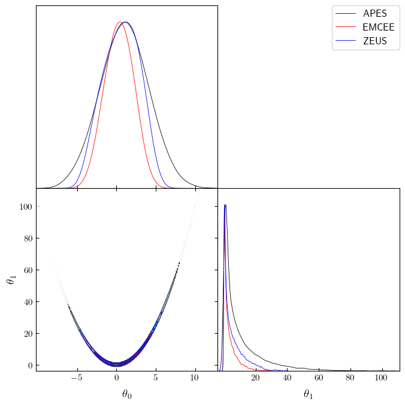

**License**

rosenbrock_simple

Sun Apr 02 21:13:00 2023\
Copyright 2023\
Sandro Dias Pinto Vitenti <vitenti@uel.br> \_\_\_ rosenbrock_simple\
Copyright (C) 2023 Sandro Dias Pinto Vitenti <vitenti@uel.br>

numcosmo is free software: you can redistribute it and/or modify it
under the terms of the GNU General Public License as published by the
Free Software Foundation, either version 3 of the License, or (at your
option) any later version.

numcosmo is distributed in the hope that it will be useful, but WITHOUT
ANY WARRANTY; without even the implied warranty of MERCHANTABILITY or
FITNESS FOR A PARTICULAR PURPOSE. See the GNU General Public License for
more details.

You should have received a copy of the GNU General Public License along
with this program. If not, see <http://www.gnu.org/licenses/>.

::: {.cell execution_count="1"}
`<details>
<summary>`{=html}Code`</summary>`{=html}

``` {.python .cell-code}
import sys

from numcosmo_py import Ncm

import matplotlib.pyplot as plt
from matplotlib.animation import FuncAnimation
from IPython.display import HTML

import numpy as np
import math

import getdist
from getdist import plots
import pandas as pd
import getdist
from getdist import plots


from numcosmo_py.sampling.apes import APES
from numcosmo_py.sampling.catalog import Catalog
from numcosmo_py.plotting.tools import set_rc_params_article

import emcee
import zeus

```

```{=html}
</details>
```
:::

::: {.cell execution_count="2"}
`<details>
<summary>`{=html}Code`</summary>`{=html}

``` {.python .cell-code}
Ncm.cfg_init()
Ncm.cfg_set_log_handler(lambda msg: sys.stdout.write(msg) and sys.stdout.flush())

ssize=300000
nwalkers = 300
verbose=False
```

```{=html}
</details>
```
:::

::: {.cell execution_count="3"}
`<details>
<summary>`{=html}Code`</summary>`{=html}

``` {.python .cell-code}
def log_prob(x, ivar):
    return -0.5 * (100.0 * (x[1] - x[0] * x[0])**2 + (1.0 - x[0])**2) * 1.0e-1

ndim, nwalkers = 2, nwalkers
p0 = np.random.randn(nwalkers, ndim)
```

```{=html}
</details>
```
:::

::: {.cell execution_count="4"}
`<details>
<summary>`{=html}Code`</summary>`{=html}

``` {.python .cell-code}
sampler_apes = APES(nwalkers=nwalkers, ndim=ndim, model=None, log_prob=log_prob, args=[0])
sampler_apes.run_mcmc(p0, ssize // nwalkers)
mcat_apes = sampler_apes.get_catalog()
mcat_apes.trim(50)
```

```{=html}
</details>
```
:::

::: {.cell execution_count="5"}
`<details>
<summary>`{=html}Code`</summary>`{=html}

``` {.python .cell-code}
sampler_emcee = emcee.EnsembleSampler(nwalkers, ndim, log_prob, args=[0])
state_emcee = sampler_emcee.run_mcmc(p0, ssize // nwalkers)
chain_emcee = sampler_emcee.get_chain(flat=True)
log_prob_emcee = sampler_emcee.get_log_prob(flat=True)
mcat_emcee = Catalog(ndim=ndim, nwalkers=nwalkers, run_type="EMCEE")
mcat_emcee.add_points_m2lnp(chain_emcee, -2.0 * log_prob_emcee)
mcat_emcee.trim(50)
```

```{=html}
</details>
```
:::

::: {.cell execution_count="6"}
`<details>
<summary>`{=html}Code`</summary>`{=html}

``` {.python .cell-code}
sampler_zeus = zeus.EnsembleSampler(nwalkers, ndim, log_prob, args=[0], verbose=verbose)
sampler_zeus.run_mcmc(p0, ssize // nwalkers, progress=False)
chain_zeus = sampler_zeus.get_chain(flat=True)
log_prob_zeus = sampler_zeus.get_log_prob(flat=True)
mcat_zeus = Catalog(ndim=ndim, nwalkers=nwalkers, run_type="ZEUS")
mcat_zeus.add_points_m2lnp(chain_zeus, -2.0 * log_prob_zeus, interweaved=False)
mcat_zeus.trim(50)
```

```{=html}
</details>
```
:::

::: {.cell execution_count="7"}
`<details>
<summary>`{=html}Code`</summary>`{=html}

``` {.python .cell-code}
sigma = np.sqrt([10.0, 2401/10])
Ncm.cfg_msg_sepa()
mcat_apes.print_status()
Ncm.cfg_msg_sepa()
mcat_emcee.print_status()
Ncm.cfg_msg_sepa()
mcat_zeus.print_status()
```

```{=html}
</details>
```
::: {.cell-output .cell-output-stdout}
    #----------------------------------------------------------------------------------
    # NcmMSetCatalog: Current mean:   1.9758       1.0136       10.771     
    # NcmMSetCatalog: Current msd:    0.0070025    0.012674     0.062675   
    # NcmMSetCatalog: Current sd:     1.9519       3.1217       14.872     
    # NcmMSetCatalog: Current var:    3.8098       9.7447       221.19     
    # NcmMSetCatalog: Current tau:    3.6681       4.6976       5.0615     
    #----------------------------------------------------------------------------------
    # NcmMSetCatalog: Current mean:   1.3812       0.34723      3.6157     
    # NcmMSetCatalog: Current msd:    0.040918     0.083599     0.21205    
    # NcmMSetCatalog: Current sd:     1.5012       1.872        4.6847     
    # NcmMSetCatalog: Current var:    2.2536       3.5045       21.947     
    # NcmMSetCatalog: Current tau:    211.74       568.34       583.91     
    #----------------------------------------------------------------------------------
    # NcmMSetCatalog: Current mean:   1.5722       0.62678      5.9135     
    # NcmMSetCatalog: Current msd:    0.017412     0.063993     0.2594     
    # NcmMSetCatalog: Current sd:     1.5732       2.3501       6.7332     
    # NcmMSetCatalog: Current var:    2.475        5.523        45.336     
    # NcmMSetCatalog: Current tau:    34.912       211.32       423.01     
:::
:::

::: {.cell execution_count="8"}
`<details>
<summary>`{=html}Code`</summary>`{=html}

``` {.python .cell-code}
mean = np.array([1.0, 11.0])
print(np.abs(mcat_apes.get_mean()/mean - 1.0))
print(np.abs(mcat_emcee.get_mean()/mean - 1.0))
print(np.abs(mcat_zeus.get_mean()/mean - 1.0))
```

```{=html}
</details>
```
::: {.cell-output .cell-output-stdout}
    [0.01362016 0.02081114]
    [0.65277315 0.67129678]
    [0.37322207 0.46240794]
:::
:::

::: {.cell execution_count="9"}
`<details>
<summary>`{=html}Code`</summary>`{=html}

``` {.python .cell-code}
print(np.abs(np.sqrt(np.diagonal(mcat_apes.get_covar()))/sigma - 1.0))
print(np.abs(np.sqrt(np.diagonal(mcat_emcee.get_covar()))/sigma - 1.0))
print(np.abs(np.sqrt(np.diagonal(mcat_zeus.get_covar()))/sigma - 1.0))
```

```{=html}
</details>
```
::: {.cell-output .cell-output-stdout}
    [0.01284634 0.04019726]
    [0.40800873 0.69766543]
    [0.25683323 0.56546444]
:::
:::

::: {.cell execution_count="10"}
`<details>
<summary>`{=html}Code`</summary>`{=html}

``` {.python .cell-code}
mcs_apes = mcat_apes.get_mcsamples("APES")
mcs_emcee = mcat_emcee.get_mcsamples("EMCEE")
mcs_zeus = mcat_zeus.get_mcsamples("ZEUS")
```

```{=html}
</details>
```
::: {.cell-output .cell-output-stdout}
    Removed no burn in
    Removed no burn in
    Removed no burn in
:::
:::

::: {.cell execution_count="11"}
`<details>
<summary>`{=html}Code`</summary>`{=html}

``` {.python .cell-code}
set_rc_params_article(ncol=2)

g = getdist.plots.get_subplot_plotter(width_inch=plt.rcParams["figure.figsize"][0])
g.settings.linewidth = 0.01
g.triangle_plot([mcs_apes, mcs_emcee, mcs_zeus], shaded=True)
```

```{=html}
</details>
```
::: {.cell-output .cell-output-stderr}
    auto bandwidth for theta_1 very small or failed (h=0.0004373082192982983,N_eff=104725.09528183742). Using fallback (h=0.002421097666703841)
    fine_bins_2D not large enough for optimal density: theta_0, theta_1
    fine_bins_2D not large enough for optimal density: theta_0, theta_1
:::

::: {.cell-output .cell-output-display}

:::
:::
