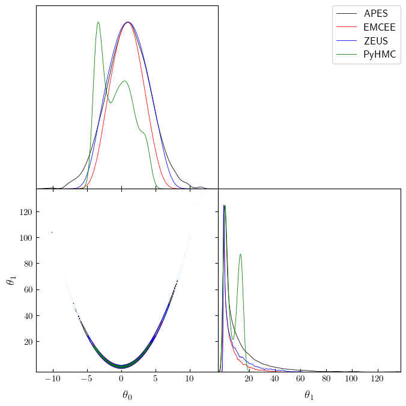

# Samplers comparison

**License**

rosenbrock_simple

Sun Apr 02 21:13:00 2023  
Copyright 2023  
Sandro Dias Pinto Vitenti <vitenti@uel.br> \_\_\_ rosenbrock_simple  
Copyright (C) 2023 Sandro Dias Pinto Vitenti <vitenti@uel.br>

numcosmo is free software: you can redistribute it and/or modify it
under the terms of the GNU General Public License as published by the
Free Software Foundation, either version 3 of the License, or (at your
option) any later version.

numcosmo is distributed in the hope that it will be useful, but WITHOUT
ANY WARRANTY; without even the implied warranty of MERCHANTABILITY or
FITNESS FOR A PARTICULAR PURPOSE. See the GNU General Public License for
more details.

You should have received a copy of the GNU General Public License along
with this program. If not, see <http://www.gnu.org/licenses/>.

``` python
import sys

from numcosmo_py import Ncm

import matplotlib.pyplot as plt
import numpy as np
import getdist
import getdist.plots

from numcosmo_py.sampling.apes import APES
from numcosmo_py.sampling.catalog import Catalog
from numcosmo_py.plotting.tools import set_rc_params_article

import emcee
import zeus
from pyhmc import hmc
```

### Initialize NumCosmo and sampling parameters

In this notebook, we will compare the performance of four different
samplers: APES, Emcee, Zeus and PyHMC. To start, we will use the new
Python interface for NumCosmo.

Next, we will define the sampling configuration. Our goal is to generate
a total of 600,000 points across all three samplers, with each sampler
using 300 walkers except for PyHMC that generates a single chain. This
translates to 2000 steps on each sampler to reach our desired sample
size. By comparing the performance of these three samplers using the
NumCosmo Python interface, we can evaluate their respective capabilities
and identify any advantages or limitations for our specific problem.

``` python
Ncm.cfg_init()
Ncm.cfg_set_log_handler(lambda msg: sys.stdout.write(msg) and sys.stdout.flush())

ssize = 600000
nwalkers = 300
burin_steps = 500
verbose = False
```

### Probability definition

In the cell below, we will define the unnormalized Rosenbrock
distribution, which is known to be a difficult distribution to sample
from. The Rosenbrock distribution is often used as a benchmark for
testing the performance of sampling algorithms. By using this
challenging distribution, we can better understand how well the samplers
perform under difficult sampling conditions.

We will generate a single initial sample point with random normal
realizations having a mean of zero and a standard deviation of one. This
initial point will be used as the starting point for each of the
samplers, ensuring that they all start at the same point.

It’s worth noting that this initial sample point is very different from
a sample from an actual Rosenbrock distribution. However, this is
intentional, as we want to see how each sampler performs under
challenging conditions.

``` python
def log_prob(x, ivar):
    return -0.5 * (100.0 * (x[1] - x[0] * x[0]) ** 2 + (1.0 - x[0]) ** 2) * 1.0e-1


def log_prob_grad(x, ivar):
    logp = -0.5 * (100.0 * (x[1] - x[0] * x[0]) ** 2 + (1.0 - x[0]) ** 2) * 1.0e-1
    grad = [
        -0.5
        * (100.0 * 2.0 * (x[1] - x[0] * x[0]) * (-2.0 * x[0]) - 2.0 * (1.0 - x[0]))
        * 1.0e-1,
        -0.5 * (100.0 * 2.0 * (x[1] - x[0] * x[0])) * 1.0e-1,
    ]
    return logp, np.array(grad)


ndim, nwalkers = 2, nwalkers
p0 = np.random.randn(nwalkers, ndim)
```

### Runnig NumComo’s APES

In the cell below, we will run NumCosmo’s APES algorithm using the
configuration defined above.

``` python
sampler_apes = APES(
    nwalkers=nwalkers, ndim=ndim, model=None, log_prob=log_prob, args=()
)
sampler_apes.run_mcmc(p0, ssize // nwalkers)
mcat_apes = sampler_apes.get_catalog()
mcat_apes.trim(burin_steps)
```

### Running Emcee

In the cell below, we will run the Emcee algorithm with the same initial
point `p0` generated previously. We will generate a chain of samples
using Emcee and store the resulting chain in a `Catalog` object. This
will allow us to apply the same tests to all algorithms and compare
their performance on an even footing.

``` python
sampler_emcee = emcee.EnsembleSampler(nwalkers, ndim, log_prob, args=[0])
state_emcee = sampler_emcee.run_mcmc(p0, ssize // nwalkers)
chain_emcee = sampler_emcee.get_chain(flat=True)
log_prob_emcee = sampler_emcee.get_log_prob(flat=True)
mcat_emcee = Catalog(ndim=ndim, nwalkers=nwalkers, run_type="EMCEE")
mcat_emcee.add_points_m2lnp(chain_emcee, -2.0 * log_prob_emcee)
mcat_emcee.trim(burin_steps)
```

### Running Zeus

In the cell below, we will run the Zeus algorithm with the same initial
point `p0` generated previously. We will generate a chain of samples
using Zeus and store the resulting chain in a `Catalog` object. One
difference from Emcee is that Zeus output chains are not interweaved, so
we need to inform the `Catalog` object of this fact to ensure that
autocorrelation estimates are correct.

``` python
sampler_zeus = zeus.EnsembleSampler(nwalkers, ndim, log_prob, args=[0], verbose=verbose)
sampler_zeus.run_mcmc(p0, ssize // nwalkers, progress=False)
chain_zeus = sampler_zeus.get_chain(flat=True)
log_prob_zeus = sampler_zeus.get_log_prob(flat=True)
mcat_zeus = Catalog(ndim=ndim, nwalkers=nwalkers, run_type="ZEUS")
mcat_zeus.add_points_m2lnp(chain_zeus, -2.0 * log_prob_zeus, interweaved=False)
mcat_zeus.trim(burin_steps)
```

### Running pyhmc: Hamiltonian Monte Carlo

In the cell below, we will run the pyhmc algorithm with the same initial
point `p0` generated previously, however since pyhmc is not an ensamble
sampler we use only the first point. We will generate a chain of samples
using pyhmc and store the resulting chain in a `Catalog` object.
Moreover, here we need to remove a longer burn-in period of 1000
samples, since pyhmc is not an ensamble sampler.

``` python
chain_pyhmc, log_prob_pyhmc = hmc(
    log_prob_grad,
    x0=np.array(p0[0]),
    args=(np.array([0]),),
    n_samples=ssize,
    return_logp=True,
)
mcat_pyhmc = Catalog(ndim=ndim, nwalkers=1, run_type="PyHMC")
mcat_pyhmc.add_points_m2lnp(chain_pyhmc, -2.0 * log_prob_zeus)
mcat_pyhmc.trim(ssize // 2)
```

### Analyzing results

In the cell below, we will create two arrays containing the true values
for the mean and standard deviation of the Rosenbrock distribution. We
will then call `print_status` on each catalog to obtain the current
mean, standard deviation, mean standard deviation, and autocorrelation
time *τ*. Based on the results, we can see that APES has the lowest
autocorrelation time *τ* for all parameters, being between 50-100 times
smaller than the autocorrelation time obtained by Emcee and Zeus.

This indicates that APES was able to explore the parameter space more
efficiently and produce less correlated samples. Additionally, we can
see that the mean, standard deviation and mean standard deviation
obtained by all samplers are close to the true values of the Rosenbrock
distribution. However, it is important to note that the Emcee and Zeus
chains may not have fully converged yet, so it is possible that their
mean and variance estimates, as well as their autocorrelation times,
could improve with further sampling.

``` python
sigma = np.sqrt([10.0, 2401 / 10])
mean = np.array([1.0, 11.0])

Ncm.cfg_msg_sepa()
mcat_apes.print_status()
Ncm.cfg_msg_sepa()
mcat_emcee.print_status()
Ncm.cfg_msg_sepa()
mcat_zeus.print_status()
Ncm.cfg_msg_sepa()
mcat_pyhmc.print_status()
```

    #----------------------------------------------------------------------------------
    # NcmMSetCatalog: Current mean:   2.0344       1.0053       11.327     
    # NcmMSetCatalog: Current msd:    0.0083706    0.011912     0.076219   
    # NcmMSetCatalog: Current sd:     2.0651       3.2121       16.204     
    # NcmMSetCatalog: Current var:    4.2647       10.318       262.57     
    # NcmMSetCatalog: Current tau:    7.3933       6.189        9.956      
    #----------------------------------------------------------------------------------
    # NcmMSetCatalog: Current mean:   1.5146       0.8295       5.8938     
    # NcmMSetCatalog: Current msd:    0.018357     0.095591     0.384      
    # NcmMSetCatalog: Current sd:     1.5435       2.2827       7.4156     
    # NcmMSetCatalog: Current var:    2.3825       5.2108       54.991     
    # NcmMSetCatalog: Current tau:    63.645       789.13       1206.7     
    #----------------------------------------------------------------------------------
    # NcmMSetCatalog: Current mean:   1.7718       1.0068       8.7195     
    # NcmMSetCatalog: Current msd:    0.031065     0.050285     0.31753    
    # NcmMSetCatalog: Current sd:     1.6732       2.7759       10.643     
    # NcmMSetCatalog: Current var:    2.7997       7.7057       113.28     
    # NcmMSetCatalog: Current tau:    155.11       147.67       400.53     
    #----------------------------------------------------------------------------------
    # NcmMSetCatalog: Current mean:   1.7415      -0.84735      6.9407     
    # NcmMSetCatalog: Current msd:    0.027216     0.44089      1.409      
    # NcmMSetCatalog: Current sd:     2.95         2.4957       5.7804     
    # NcmMSetCatalog: Current var:    8.7024       6.2287       33.413     
    # NcmMSetCatalog: Current tau:    25.534       9362.1       17826      

### Comparing the mean estimates

Below, we compare the mean estimates obtained by each sampler and print
the relative error on each estimate. As we can see, APES is the only
sampler that is able to recover the true means within 1% - 2% error,
while Emcee and Zeus exhibit much larger errors.

``` python
print(np.abs(mcat_apes.get_mean() / mean - 1.0))
print(np.abs(mcat_emcee.get_mean() / mean - 1.0))
print(np.abs(mcat_zeus.get_mean() / mean - 1.0))
print(np.abs(mcat_pyhmc.get_mean() / mean - 1.0))
```

    [0.00534514 0.02974697]
    [0.17050423 0.4642045 ]
    [0.00682038 0.20732131]
    [1.84735064 0.36902792]

### Comparing the standard deviation estimates

Similar to the previous comparison, we now look at the relative error on
the standard deviation estimates. Once again, APES performs the best
among the samplers, with estimates within 1% - 4% of the true values.

``` python
print(np.abs(np.sqrt(np.diagonal(mcat_apes.get_covar())) / sigma - 1.0))
print(np.abs(np.sqrt(np.diagonal(mcat_emcee.get_covar())) / sigma - 1.0))
print(np.abs(np.sqrt(np.diagonal(mcat_zeus.get_covar())) / sigma - 1.0))
print(np.abs(np.sqrt(np.diagonal(mcat_pyhmc.get_covar())) / sigma - 1.0))
```

    [0.01576792 0.04574835]
    [0.27814386 0.52142614]
    [0.12217818 0.31313443]
    [0.21077586 0.62695513]

### Using `getdist` on the chains

In this next cell, we convert the catalog of MCMC chains for each
algorithm into `MCSamples` objects using the `getdist` package. This
allows us to easily plot the joint and marginal posterior distributions
of the parameters using the `getdist` `plotter`.

``` python
mcs_apes = mcat_apes.get_mcsamples("APES")
mcs_emcee = mcat_emcee.get_mcsamples("EMCEE")
mcs_zeus = mcat_zeus.get_mcsamples("ZEUS")
mcs_pyhmc = mcat_pyhmc.get_mcsamples("PyHMC")
```

    Removed no burn in
    Removed no burn in
    Removed no burn in
    Removed no burn in

### Corner plot

Finally, we create a joint corner plot of the samples using `getdist`.
We can see that the other samplers (Emcee and Zeus) have more difficulty
in sampling the tails, leading to the 1D marginals being more
concentrated and reporting smaller variance. This is reflected in the
larger relative errors in the mean and standard deviation estimates we
saw earlier.

``` python
set_rc_params_article(ncol=2)

g = getdist.plots.get_subplot_plotter(width_inch=plt.rcParams["figure.figsize"][0])
g.settings.linewidth = 0.01
g.triangle_plot([mcs_apes, mcs_emcee, mcs_zeus, mcs_pyhmc], shaded=True)
```

    auto bandwidth for theta_0 very small or failed (h=0.000264873376699719,N_eff=32286.89337404226). Using fallback (h=0.023574362536605796)
    auto bandwidth for theta_1 very small or failed (h=0.0004570819762599289,N_eff=111770.21263323116). Using fallback (h=0.002694796107662412)
    auto bandwidth for theta_1 very small or failed (h=0.00027723025285961926,N_eff=31660.725563384418). Using fallback (h=0.02142883143142616)
    fine_bins_2D not large enough for optimal density: theta_0, theta_1
    fine_bins_2D not large enough for optimal density: theta_0, theta_1
    fine_bins_2D not large enough for optimal density: theta_0, theta_1
    fine_bins_2D not large enough for optimal density: theta_0, theta_1


